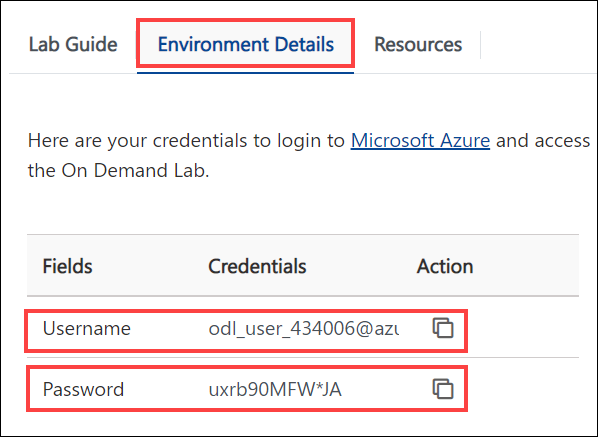
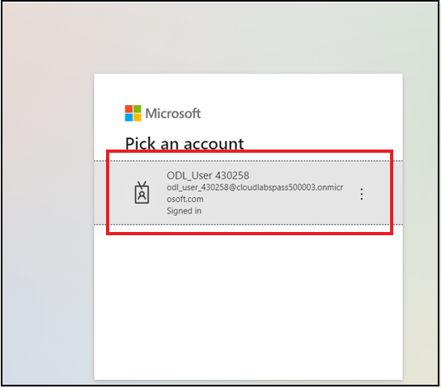
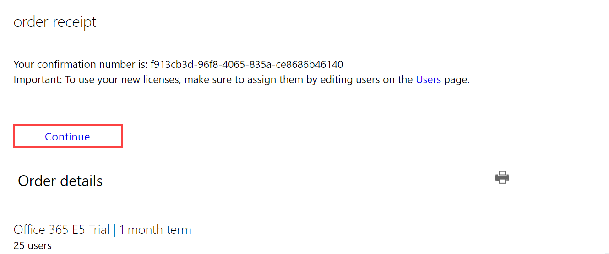

# Getting Started

1. Use the azure credentials provided in the **Environment Details** tab to log in to the **Office 365 Admin Portal**.

   

# Sign up for Office 365 E5 free trial

1. Open a new browser window, click on the [Sign up for Office 365 E5 free trial](https://www.microsoft.com/en-in/microsoft-365/enterprise/office-365-e5) and click on **Free trial**.

   

1. Then on the next screen, Enter the work email address as provided in the **Environment Details** and click on **Next**.

   

1. Click on **Sign in**. 

   

1. Select **Skip for Now[1]** and Click on **Next[2]**.

   

1. Click on the **Account**, you just signed in. 

   

1. Enter the **Phone Number**, then it will ask you to enter a **verification code** and **verify**.
   >**Note**: Make sure to provide a valid mobile number and choose the country code properly.

   

1. It show you the confirmation Message, Click on **Try Now**.

   

1. Will receive the order Receipt.

   
   
1. On the Next Page, Learn about how to create users, assign a license to the users, verify custom domains in the tenant, and see how to access other admin centers.    

   

