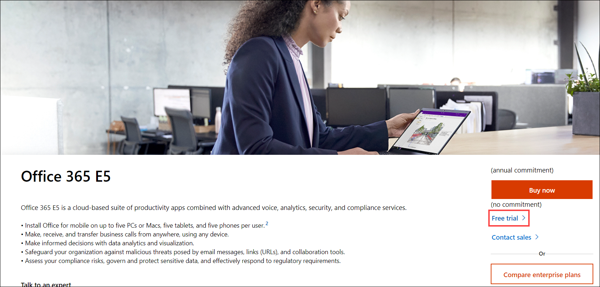
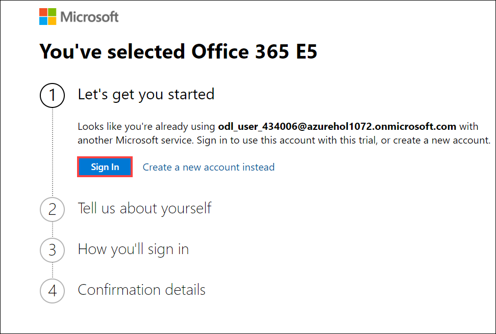
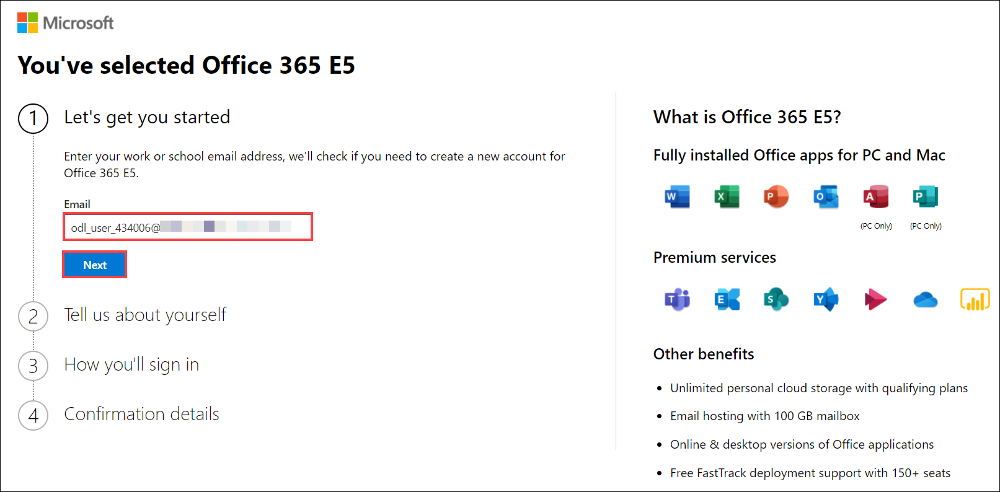
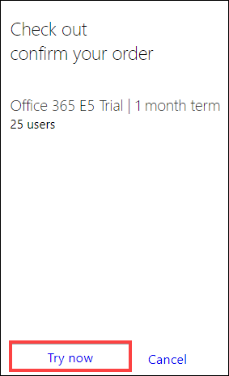

# Getting Started
## Log-in to the Azure Portal

1. In the virtual machine provided on the left side, open a new browser window and sign in to the **Azure Portal**.

1. Use the azure credentials provided in the **Environment Details** tab to log in to the portal.

1. Open this [URL](https://mcas-proxyweb.mcas.ms/certificate-checker?login=false&originalUrl=https%3A%2F%2Fgo.microsoft.com.mcas.ms%2Ffwlink%2Fp%2F%3FLinkID%3D698279%26clcid%3D0x4009%26culture%3Den-in%26country%3DIN) and click on Free trial.

1. Then on the next screen, Click on **Sign in**.  provide a username like below and click on **Next**.

1. Provide a **Username** like below and click on **Next**.

1. Select **Skip for Now[1]** and Click on **Next[2]**.

1. Select the **Username**.

1. Then provide the details like below and then it will ask you to enter a **verification code** (Make sure to provide a valid mobile number and choose the country code properly), enter it and **verify**.

1. It show you the confirmation Message, Click on **Try Now**.

1. Will get the order Receipt.

