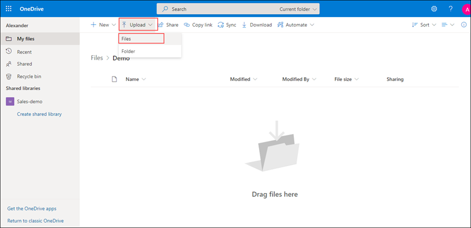
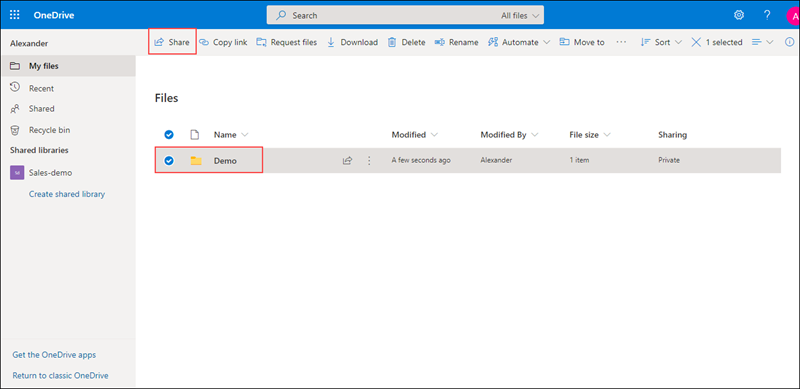
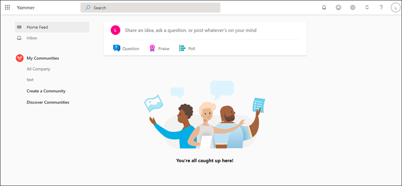
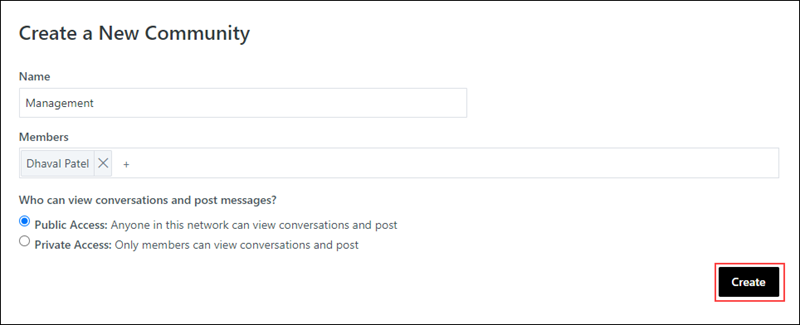
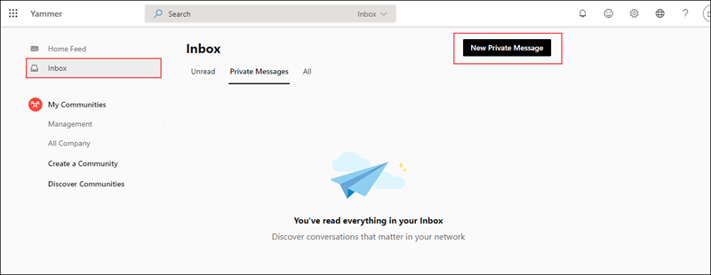
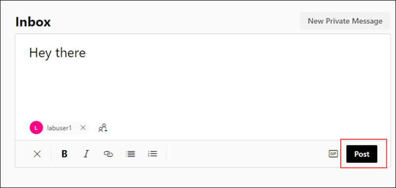
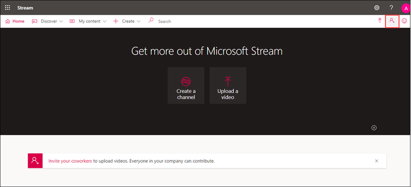
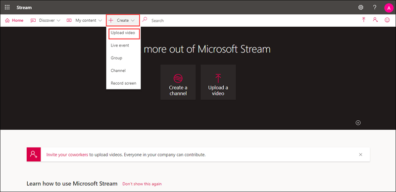
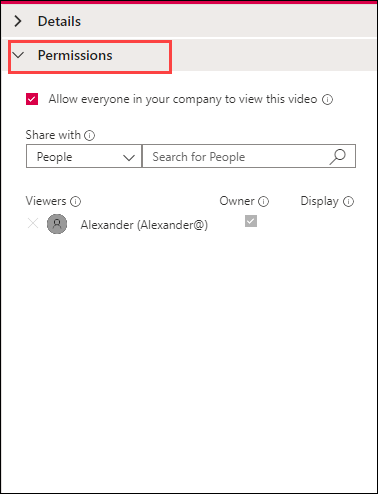
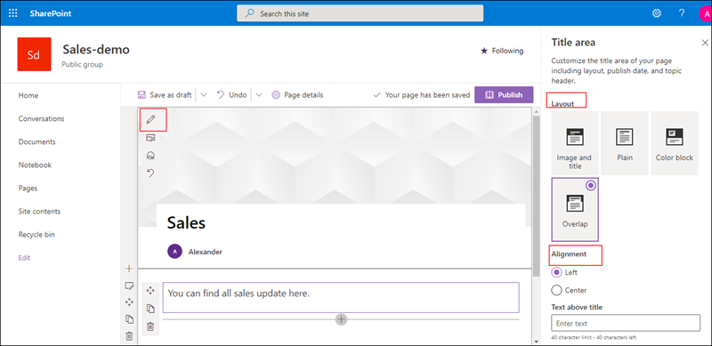

# MS-900

# Module 1: Introduction to Microsoft 365 Admin Center

The Microsoft 365 admin center is where you manage your business in the cloud. You can complete such tasks as adding and removing users, changing licenses, and resetting passwords. Here are the features and settings you'll find in the left-hand navigation of the admin center.
  
   - Home : This is the landing page in the admin center. You'll see where to manage users, billing, service health, and reports.
   
   - Users : Create and manage users in your organization, like employees or students. You can also set their permission level or reset their passwords.
   
   - Groups : Create and manage groups in your organization, such as a Microsoft 365 group, distribution group, security group, or shared mailbox.
   
   - Resources : Create and manage resources, like a SharePoint site collection. 
   
   - Billing : View, purchase, or cancel subscriptions for your organization. View past billing statements or view the number of assigned licenses to individual users.
   
   - Support : View existing service requests or create new ones.
   
   - Settings : Manage global settings for apps like email, sites, and the Office suite. Change your password policy and expiration date. Add and update domain names like contoso.com. Change your organization profile and release preferences. And choose whether partners can access your admin center.
   
   - Setup : Manage existing domains, turn on and manage multi-factor authentication, manage admin access, migrate user mailboxes to Office 365, manage feature updates, and help users install their Office apps
   
   - Reports : See at a glance how your organization is using Microsoft 365 with detailed reports on email use, Office activations, and more.
   
   - Health : View the service health at a glance. You can also check out more details and the service health history.
   
   - Admin centers : Open separate admin centers for Exchange, Skype for Business, SharePoint, Yammer, and Azure AD. Each admin center includes all available settings for that service.

# Exercise 1: Admin Experience for User Management

  In this exercise, you will learn how to create users, assign license to the users, verify custom domains in the tenant and see how to access other admin centers.
  
### Task 1: Admin Experience for User Management

1. Open a new browser window and login to the admin center at [https://admin.microsoft.com](https://go.microsoft.com/fwlink/p/?linkid=2024339).

1. When prompted, use the credentials provided in the **Environment Details** page to log in to the admin center.

1. From the navigation menu, click on the **Users** icon and click on **Active users**. Here you can see the users that are active.

   

1. From the navigation menu click on **Groups** icon and click on **Active groups**. This will display list of all the groups that are created.

   

1. Now to create a new user, from the navigation menu click on **Users icon** and click on **Active users** , Now select **Add a user** icon.

   

1. In the **Set up the basics pane** , fill in the basic user information, and then select Next.

   - **Display Name:** Enter a name for user.

   - **Username:** Enter username.

     

   - **Password settings:** select let me create password and provide password.

   - **Require this user to change their password when they first sign in** : selected.

     

1. In the  **Assign product licenses**  pane, choose your location from the **select location** dropdown. In the licenses section, choose **Assign user a product license**  and   select **office 365 E5** license. Click **Next**.

   

1. In the  **Optional settings**  pane, leave everything as default and click on **Next**.

   

1. In **Review and Finish** pane, review the new user&#39;s settings and click on **Finish adding**, then **Close**.

   
   
1. Verify that the user has been created successfully. In the Microsoft 365 admin center, in the left navigation pane, select **Users** and select **Active users**. The new user should be listed, along with their assigned license.
   
### Task 2: Verify Custom Domains in the tenant [Read-Only]

1. To verify the custom domains, from navigation pane click on show all, select **Settings** and choose **Domains**.

   

1. All the available domains can be found here. We can also purschase new domains or add any existing domain from the **Domains** page.

1. To add an domain Select **Add domain**. Enter the name of the **domain** you want to add, then select **Use this domain**.

    

1. In **Domain veriifcation** page choose how you want to verify that you own the domain. Select **Add a TXT record to the domain's DNS records** and  click on **Continue**.

    

1. Now in **Verify your domain** page copy the **TXT name** and **TXT value**. 

    

1. Go to your domain's registrar or DNS hosting provider, go to DNS management page of your domain and click on **+ Record set**. Under **Name**  paste the **TXT name** and under **Value** paste **TXT value** you copied earlier and in type select **TXT**. Once done click on **Ok**. 

    

1. Wait for the record set to be created. Switch back to the admin center, click on **Verify** and select **Continue**.

1. In **Add DNS records** page follow the instructions and click on **Continue**.

   

1. Select **Ok** when domain setup is complete.

   
   
1. In the domains page you can see the newly added domain.

   

1. To learn more about managing domains from Microsoft admin center refer to  https://docs.microsoft.com/en-us/microsoft-365/admin/get-help-with-domains/what-is-a-domain?view=o365-worldwide

### Task 3 : Access other admin centers 

1. To access other admin centers, from navigation pane select **Admin centers** and choose all **All Admin centers**. Opens a page with a full list of Office 365 admin centers, including admin centers for OneDrive, Yammer Enterprise, Dynamics 365, Power Apps, Skype for business, and other services.

   
   
1. In the admin centers page select **Exchange**. This will redirect you to Exchange admin center page. 

   

1. From here you can manage email settings for your organization. In .the left hand menu explore through the options available

     - **Recipients**  - View and manage your mailboxes (both user and shared mailboxes), groups, resource mailboxes, and contacts.

     - **Mail flow**   -  Manage remote domains and accepted domains, add connectors, trace messages and manage alert and alert policies.
     
     - **Migration**   -  Migrate mailboxes in batches.
     
     - **Reports**     - 	View reports on mail flow and migration batches.
     
     - **Insights**    - 	Use the recommendations to discover trends and/or insights, and take actions to fix issues related to mailbox and mail flow.
     
       

1. Switch back to the admin centers page, select **SharePoint**. This will redirect you to Sharepoint admin center page.

   

1. From here you can manage site collections, list and library permissions, file storage and sharing. Explore through the options available in **SharePoint** admin center.

   

1. In the same way you can access and explore through all other admin centers available.
   
### Exercise 2 : Explore Microsoft 365 Apps

 In the previous exercise you created a user and assigned office 365 E5 license. In this exercise you will login with the newly created user and explore through office365 apps.

### Task 1 : Explore Outlook

1. Microsoft Outlook is an application that is used mainly to send and receive emails. It can also be used to manage various types of personal data including calendar appointments and similar entries, tasks, contacts, and notes.

1. Now login with the newly created user. Open a new browser window and login to the office365 center at https://www.office.com.

1. When prompted enter the username and password of the user that you created in the previous step.

   >**Note**: You can get the username by clicking on **Users** and then **Active users** from the navigation menu. In the Active Users pane note down the username for your newly created  user

1. When logging in with the new user for the first time it will prompt you to update your password, provide your current password and new password and select sign in.
    
1. From the top right corner click on **App launcher**

1. Under **Apps**, select **Outlook** and from **Open context menu** click on **Open in new tab**. This will redirect you to the outlook mail.
   
   
   
1. In the outlook page, choose **New message**  to send a new mail. Enter a name or email address in the To, Cc, or Bcc field. In Subject, type the subject of the email message.  Place the cursor in the body of the email message, and then start typing.  After typing your message, choose Send.

   
   
1. From the left hand menu select **Calendar**. From here you can create appointments, events, organize meetings and view group schedules.

   
   
1. Now Select **People**, you can use the People page to view, create, edit, find, and delete contacts. You can use your contacts for your own reference, and can automatically add them as recipients when you compose an email message.

   

1. From the left hand menu you can explore through all other options available. 
   
### Task 2 : Explore OneDrive

1. OneDrive gives you one place to store, share, and sync your work or school files. As part of your organization's Microsoft 365 subscription, you can save your files in OneDrive and then work with them from almost any device, share files with others, give others permission to edit files and work on them at the same time.

1. Switch back to the user account and from  **App launcher** under **Apps**, select **OneDrive**. From **Open context menu** click on **Open in new tab**. This will redirect you  to the **OneDrive** page, from here you can manage all your **files**.
   
   
   
   

1. Now we will try to create a folder and upload files to it. In the OneDrive page click on **New** and select **Folder** option, when prompted provide a name for your folder and click on **Create**.
  
   
   
   
   
1. Now select the newly created folder. From the top navigation bar select **Upload** and select **Files**, when prompted choose the file(s) that you want to upload.

   
   
1. Select the new file that you have uploaded, click on **Show actions** icon. This will display the list of actions that can be performed.

   
   
1. In the **OneDrive** page select the file or folder you want to share by selecting the circle in the upper corner of the item. Select Share at the top of the page.

   

1. Select **Anyone with the link can edit to customize the link** option. Set the options you want on your link, then select Apply when you're done.

      

      - **Anyone** : Gives access to anyone who receives this link, whether they receive it directly from you or forwarded from someone else. This may include people outside of your organization.
      
      - **People in (Your Organization)** : Gives access to anyone in your organization who has the link access to the file.
      
      - **People with existing access** : Provides a link that can be used by people who already have access to the file or folder. It does not change the permissions on the item. Use this if you just want to send a link to somebody who already has access.
      
      - **Specific people** : Gives access only to the people you specify, although other people may already have access. 
      
      - **Allow editing** :  select if you want others to be able to edit the file. Uncheck it if you only want others to be able to view the file.
      
      - **Set expiration date**  : The link will only work until the date you set. After that, the link will be invalid, and you will need to create a new link for users requiring access to your file or folder.

     - **Set password**  : When a user clicks the link, they will be prompted to enter a password before they can access the file. You'll need to provide this password separately to users.
     
       
       
1. Once you're back at the main **Share** box enter a name or email of user's with whom you intend to share the file, click on **Send**. You can also select **Copy Link** to copy the link to your clipboard and share.

   
  
1. You can explore through other options available in the **OneDrive**. 

### Task 3  : Explore yammer

1. With yammer people can openly connect and engage across the organization, from here we can discuss ideas, share and collaborate with others.

1. Switch back to the office365 portal and from  **App launcher** under **Apps**, select **Yammer**. From **Open context menu** click on **Open in new tab**, this will redirect you  to the **Yammer** page. 
   

1. From the left hand pane click on **Create a group**, enter a name for your group. In **Group Members** search and select the user you want to add. Based on your requirement choose **Public** or **Private** access and click on **Create Group**.

   
   
1. Now select the group that you newly created, click on **Update**. Type the content that you like to post (you can include gifs, files or any website links based on the requirement). Click on **post**.
  
   
   
1. Switch back to the yammer account of the user whom you added to the group and verify if the user is added to newly created group and if the posts are visible.
   
   
  
1.  We can also send a private message to a specific person in Yammer.
   
1.  In the yammer dashboard click the **+** icon next to **Private Messages** from the left sidebar. When prompted select **Send Private Message**.
   
    

1. In the Add Participants field, search or type the person's username. A drop-down menu of usernames that matches will appear.

1. Select the person's name that you want the message to be sent to, enter the message you want to send and then click on **Send Message**.

   

1. The recipient of the message will recieve a notification about the recieved private message.

1. Explore through other options available in yammer.

### Task 4: Explore Microsoft Stream

1. Microsoft Stream is an Enterprise Video service where people in your organization can upload, view, and share videos securely. You can share recordings of classes, meetings, presentations, training sessions, or other videos that aid your team's collaboration.

1. In office365 portal from the  **App launcher** click on **All apps** and in the search bar search for **Stream**, from **Open context menu** click on **Open in new tab**, this will redirect you to the **Stream** web page. 

1. In the Stream navigation bar, click on **Invite** button.
   
   
   
1. In the search bar, search and select the users or groups that you would like to invite. Click on **Add** and then select **Invite**.
   
   

1. Now, from the top navigation bar of the **Stream** dashboard, click on **Create** button and select **Upload video** option from the drop down.

   

1. Drag and drop or select files which needs to be uploaded from your device. In the Details tab, you can rename  the video, add a description, and choose a thumbnail for the video. 

1. Under the "Permissions" tab, you can configure access to the video inside of the organization. 

   
   
1. Now click on the "Options" tab. From here you can enable/disable the ability to tag people, have a comments section, have captions, or add subtitles.
 
   

1. Click on **Publish**.
   
   

1. From  the Stream navigation bar, click on **Discover**. You can browse for videos, channels, people in your organization, and groups from here.

   

1. To learn more about Microsoft Stream refer to https://docs.microsoft.com/en-us/stream/overview.

### Task 5 : Explore SharePoint

1. Microsoft SharePoint  helps organizations share and manage content, knowledge, and applications to Empower team work, Quickly find information and Seamlessly collaborate across the organization.

1. Switch back to the office365 portal, from the  **App launcher** click on **All apps**. In the search bar search for **SharePoint**, from **Open context menu** click on **Open in new tab**. This will redirect you  to the **SharePoint** web page. 

1. From the top of the SharePoint page, click **+ Create site**  option.
  
   

1. A site creation wizard will appear on the right-hand side of the screen. Based on your requirement you  can select **Team site** or **Communication site**. For now select **Team site**.
   
   
   
    - Provide a name for your site
    
    - In Privacy settings section, choose either **Public - anyone in the organization can access this site** or **Private - only members can access this site** to control who has access to your site.

    -  Select a language for your site and click on **Next**
    
       
    
    -  In **Add group members** pane, under **Add additional owners box** add the names or email addresses of others whom you would want to allow to manage this site. In **Add members box**, add the name or email address of users you want to be a member of your site and then click **Finish**.  
    
1. Now  let us add and publish a page in the newly created site.

1. In the home page of the site click on **New**, and then select **Page**.

   

1. Choose a page template to start with. For now you can select **Blank** template and click on **Create page**.

   

1. Add a page name in the title area. You can customize the title area with an image, a choice of four layouts, text above the title, the ability to change the displayed author, and you can show or hide the published date.

1. Select **Edit web part** icon from here you can select the layout of your choice, Set alignment, Add text above the title.
  
   

1. To add an image click on **Add image** button in the toolbar on the left. 

   

1. Choose a recent image or get an image from a web search, your site, your computer, or a link. If your organization has specified a set of approved images, you'll be able to choose from that set under Your organization. 

   

1. In **text box** you can add the content. Click on **+** to add content like text, documents, video and more. 

    

1. When done, click **Publish**. This will publish a page in your site.

1. To learn more about SharePoint refer to https://docs.microsoft.com/en-us/sharepoint/introduction.

### Task 6 : Exlpore List

1. List helps to track information and organize your work. With list one can track issues, assets, routines, contacts, inventory and more using customizable views and smart rules and alerts to keep everyone in sync.

1. In office365 portal from the  **App launcher** click on **All apps** and in the search bar search for **List**, from **Open context menu** click on **Open in new tab**, this will redirect you to the **List** web page. 

1. In the home page of **Lists** click on **New list**. 

   

1. From the Create a list page, select **Blank list**. 
 
    - Provide a name for your list and if needed  provide description.
    
    - Choose a color and icon for your list.
    
    - In **Save to** select a location where you want your list to be saved. Click on **Create**
    
      
    
 1. When your list opens, to add an item to your list, select **+ New**. 
  
    
 
 1. Under **Title** provide a name for your new item, if needed you can also add attachements. Once done click on **Save**.
 
 1. To add  column, select **+ Add column**. In the dropdown, select the type of column you want.
 
    
 
 1. In the Create a column panel, in the **Name** field, enter a title or column heading. Enter any other required information. The number of fields will vary with column type you choose. The above example is for a **Multiple lines of tes** field.
 
     

1. Select **Save**. In this way you can add multiple items and columns to your list.

1. To rename a column, select the column which you wnat to rename select **Coloumn settings** and select **Rename**. When prompted provide column name and select **Save**.

   

1. Now select the item which you have added click on **Show actions** and select **Edit**  from here you can add value against newly created column.

    
    
    

1. To share your list  select **Share** near the top of the page.

   
    
1. Enter a name or email address. To change the access permissions you are granting to people, select **Can edit** and then select a option based on requirement. 

   

1. Check **Notify people** check box if you want user to get notified when a list is shared. Select Grant access.

   

1. To create an alert for a list or list item. Select the list that you want to create an alert for. On the command bar, click the ellipses, and then select **Alert me** this display the **Alert me when items change dialog box**.

   

1. In the Alert Title section, change the title for the alert if you want. With in the **Send Alerts To section**, enter the user names or email addresses of people you want alerts to be sent to.

1. Select a delivery method, choose the types of changes that you want to be notified about, how frequently you want to receive the alert. Once done select **Ok**.

    

1. Depending on how your site and servers are set up, whenever changes are made the person you created an alert for will be notified.

1. You can explore through other options available.

## Conclusion

This module helps you to understand how to create users and assign license to the users from the Microsoft 365 admin center. The module also explains the way to add domains and the process to access other admin centers. It also explores through various office365 apps.
 

    

       

