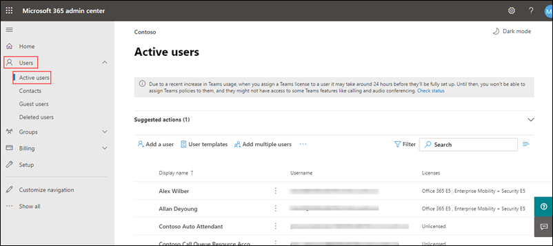
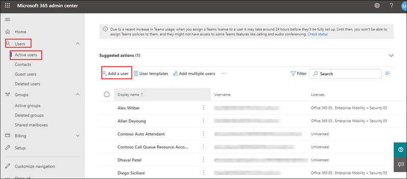
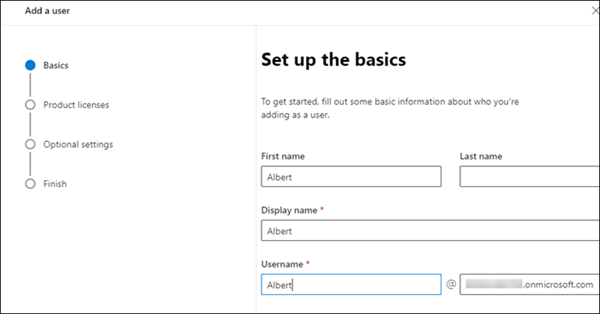
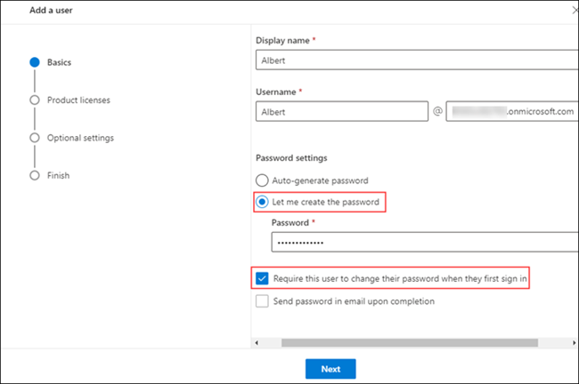
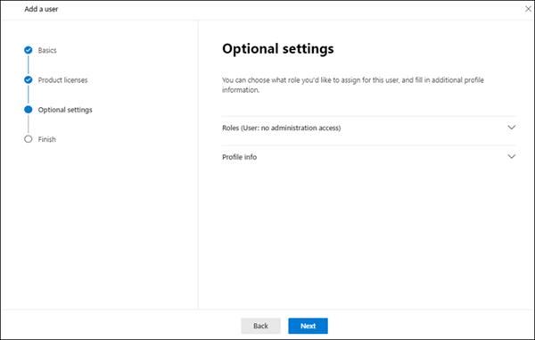
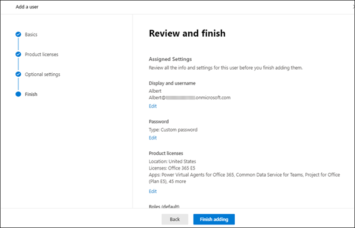
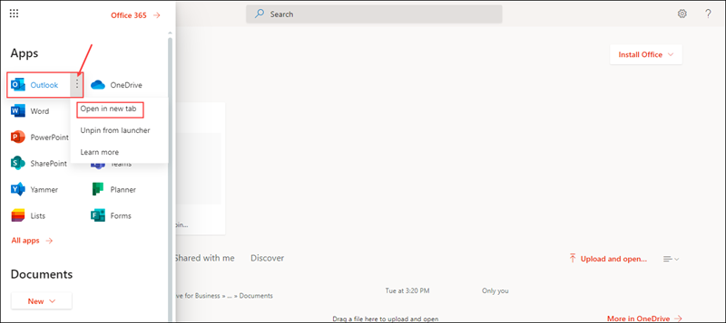

# MS-900

# Module 1: Intro to Microsoft 365 Admin Center

# Exercise 1: Admin Experience for User Management

### Task 1: Admin Experience for User Management

1. open a new browser window and login to the admin center at [https://admin.microsoft.com](https://go.microsoft.com/fwlink/p/?linkid=2024339).

1. Use the credentials provided in the **Environment Details** page to log in to the admin center when prompted.

1. From the navigation menu click on **Users** icon and click on **Active users** from here you can see the users that are active.

   

1. From the navigation menu click on **Groups** icon and click on **Active groups** this displays list of all the groups that are created

   

1. Now let us create a new user.

1. From the navigation menu click on **Users icon** and click on **Active users** , Now select **Add a user** icon.

   

1. In the **Set up the basics pane** , fill in the basic user information, and then select Next.

   - **Display Name:** Enter a name for user.

   - **Username:** Enter username.

     

   - **Password settings:** select let me create password and provide password.

   - **Require this user to change their password when they first sign in** : selected.

     

1. In the  **Assign product licenses**  pane, select the location and in licenses under **Assign a user product license** select **office 365 E5** license and select **Next**.

   

1. In the  **Optional settings**  pane, leave everything as default and click on **Next**.

   

1. In **Review and Finish** pane review your new user&#39;s settings, then select  **Finish adding** , then  **Close**.

   

### Task 2: End User Experience

1. Now we will login with the newly created user.

2. open a new browser window and login to the admin center at [https://admin.microsoft.com](https://go.microsoft.com/fwlink/p/?linkid=2024339).

1. When prompted enter the username and password of the user that you created in the previous step.

   >**Note**: you can get username by clicking on **Users**  and  **Active users** from navigation menu and in Active Users pane note username for your newly created  user

1. When logging in with the new user for the first time it will prompt you to update your password, provide your current password and new password and select sign in.
   
   >**Note**: Ignore the error message displayed
    
1. From the top right corner click on **App launcher**

1. Under **Apps** select **outlook** this will redirect you to the outlook mail.
   
    

1. Switch back to the admin portal and from  **App launcher** select **OneDrive** under **Apps**.

### Task 3: Verify Custom Domains in the tenant and Access other admin centers

1. To verify the custom domains, from navigation pane select **Settings** under settings select **Domains**.

1. The available domains can be found here.We can also purschase new doamins or add any existing domain from **Domains** page.

1. To access other admin centers, from navigation pane select **Admin centers** and select **All Admin centers**.

