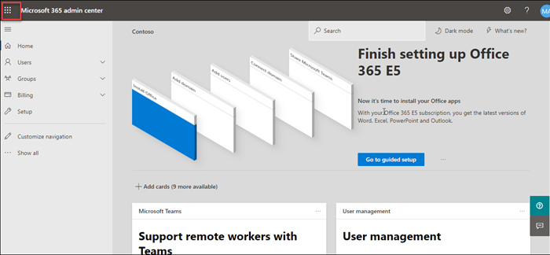
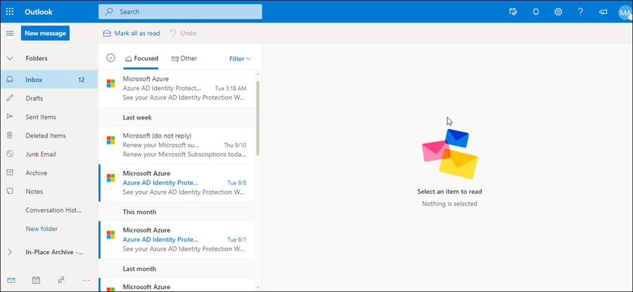

# MS-900

# Module 2: Explore Microsoft 365 Apps 

# Exercise 1: Exploring  Microsoft 365 Apps

1. Open a new browser window and login to the admin center at https://admin.microsoft.com.

1. When prompted, use the credentials provided in the **Environment Details** page to log in to the admin center.

1. Now let us explore through the **Microsoft 365 Apps**.

1. From the top right corner click on **App launcher**.
  
   

1. Under **Apps** select **outlook** and from **Open context menu** click on **Open in new tab** this will redirect you to the outlook mail.

   
   
1. In the outlook page from the left hand menu you can explore through all the options avaialbale.

   
   
1. Switch back to the account and from  **App launcher**, under **Apps** select **OneDrive** and  from **Open context menu** click on **Open in new tab** this will redirect you  to the **OneDrive** page. From here you can manage all your **files**.
   
   
   
   

1.

