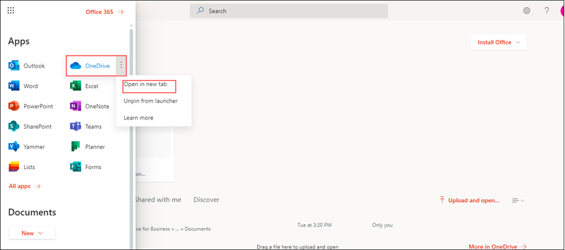
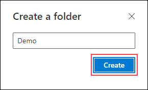
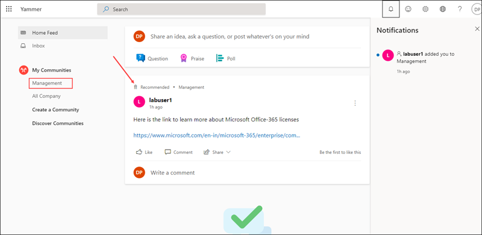

# MS-900

# Module 2: Explore Microsoft 365 Apps 

# Exercise 1: Exploring  Microsoft 365 Apps

1. Open a new browser window and login to the admin center at https://admin.microsoft.com.

1. When prompted, use the credentials provided in the **Environment Details** page to log in to the admin center.

1. Now let us explore through the **Microsoft 365 Apps**.

1. From the top right corner click on **App launcher**.
  
   

1. Under **Apps** select **outlook** and from **Open context menu** click on **Open in new tab** this will redirect you to the outlook mail.

   
   
1. In the outlook page from the left hand menu you can explore through all the options avaialbale.

   
   
### Task 2 : Explore OneDrive

1. Switch back to the account and from  **App launcher**, under **Apps** select **OneDrive** and  from **Open context menu** click on **Open in new tab** this will redirect you  to the **OneDrive** page. From here you can manage all your **files**.
   
   
   
   

1. Now we will try creating an folder and upload files into it. In the OneDrive page click on **New** icon and select **Folder** option, when prompted provide a name for your folder and select **Create**.
  
   
   
   
   
1. Now clcik on the newly create folder. From the top select **Upload** icon and select **Files**, when prompted select the **File** that you want to upload.

   
   
1. Select the new file that you have created, click on **Show actions** icon this will display the list of actions that can be performed.

   

1. You can explore through other options available in the **OneDrive** pane.

### Task 3  : Explore yammer

1. Switch back to the admin account and from  **App launcher**, under **Apps** select **Yammer**.From **Open context menu** click on **Open in new tab** this will redirect you  to the **Yammer** page. With yammer people can openly connect and engage across an organization, from here we can discuss ideas, share and collaborate with others.

   

1. From the left hand pane select **Create a group**  button, enter a name for you group and in **Group Memmbers** search and select the user you created. Based on your requirement select the **Public** or **Private** access and click on **Create Group**.

   
   
1. Now select the group that you newly created, clcik on **Update** type content which you like to post (you can include gifs, files or any website links based on the requirement). Click on **post**.
  
   
   
1. Switch back to the yammer account of the user which you added to the group, and verify if user is added to newly created group and posts are visible.
   
   
  
1.  We send a private message to a specific person in Yammer.
   
1. From yammer dashboard click the **+** next to **Private Messages** on the left sidebar. When prompted select **Send Private Message**.
   
   

1. In the Add Participants field, search or type the person's user name. A drop-down menu of user names that are matches appears.

1. Select the person's name that you want the message to be sent to, enter the message you wnat to send and then click on **Post**.

1. The recipient of the message will receive a notification about the received private message.

### Task 4: Explore Microsoft Stream

1. Microsoft Stream is an Enterprise Video service where people in your organization can upload, view, and share videos securely. You can share recordings of classes, meetings, presentations, training sessions, or other videos that aid your team's collaboration.

1. From the  **App launcher** click on All apps and in the search bar search for **Stream**, from **Open context menu** click on **Open in new tab** this will redirect you  to the **Stream** web page. 

1. In the Stream navigation bar, select **Invite** button.
   
    
   
1. In the search bar search and select the users or groups you would like to invite to Stream, clcik on **Add** and the select **Invite**.
   
    

1. Now from the Microsoft **Stream** dashboard from the top navigation bar,  click on  **Create** button and from the drop down select **Upload video** option.

1. Drag and drop or select files which needs to be uploaded from your device. In the Details tab, you can rename  the video, add a description, and choose a thumbnail for the video. 

1. Under the "Permissions" tab, you can configure access to the video inside of the organization. 

1. Now click on the "Options" tab. From here you can enable/disable the ability for tagging people, having a comments section, having captions, or adding subtitles.

1. Select **Publish**.

1.

