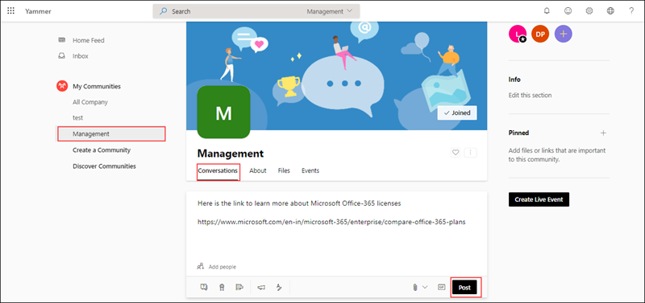
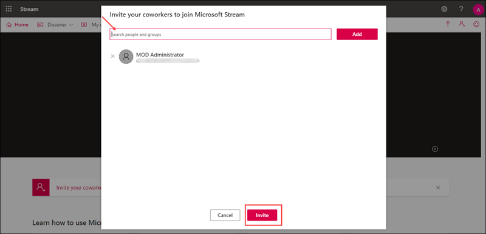
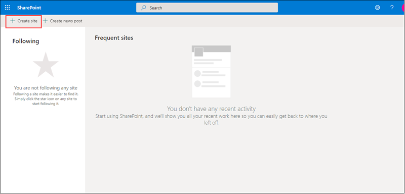
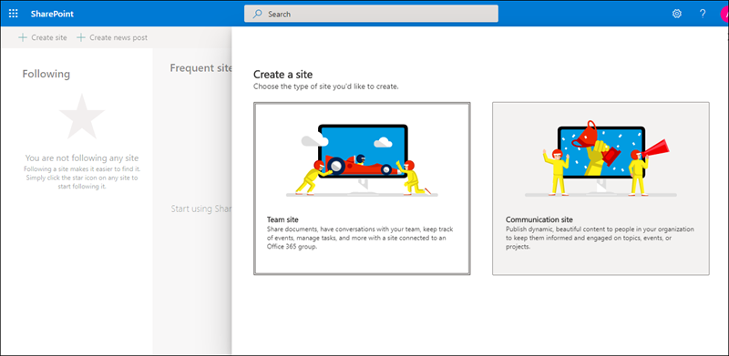
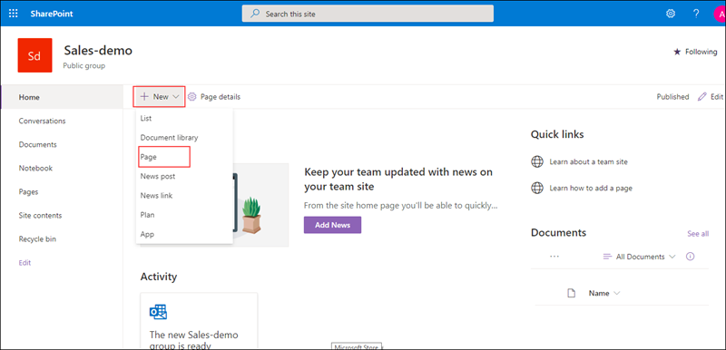
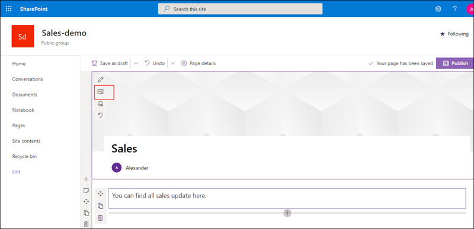
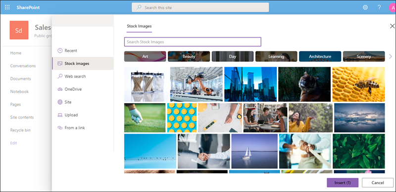
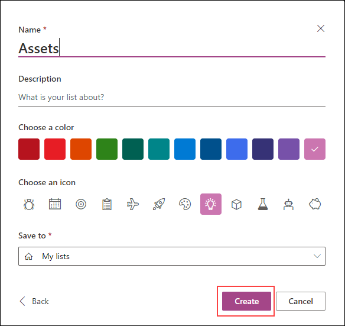

# MS-900

# Module 2: Explore Microsoft 365 Apps 

# Exercise 1: Exploring  Microsoft 365 Apps

1. Open a new browser window and login to the admin center at https://admin.microsoft.com.

1. When prompted, use the credentials provided in the **Environment Details** page.

1. Now let us explore **Microsoft 365 Apps**.

1. From the top right corner click on **App launcher**.
  
   

1. Under **Apps** select **outlook**. From **Open context menu** click on **Open in new tab** this will redirect you to the outlook mail.

   
   
1. In the outlook page from the left hand menu you can explore through all the options available.

   
   
### Task 2 : Explore OneDrive

1. Switch back to the user account and from  **App launcher** under **Apps**, select **OneDrive**. From **Open context menu** click on **Open in new tab**. This will redirect you  to the **OneDrive** page, from here you can manage all your **files**.
   
   
   
   

1. Now we will try to create a folder and upload files to it. In the OneDrive page click on **New** and select **Folder** option, when prompted provide a name for your folder and click on **Create**.
  
   
   
   
   
1. Now select the newly created folder. From the top navigation bar select **Upload** and select **Files**, when prompted choose the file(s) that you want to upload.

   
   
1. Select the new file that you have uploaded, click on **Show actions** icon. This will display the list of actions that can be performed.

   

1. You can explore through other options available in the **OneDrive**.

### Task 3  : Explore yammer

1. Switch back to the admin account and from  **App launcher** under **Apps**, select **Yammer**. From **Open context menu** click on **Open in new tab**, this will redirect you  to the **Yammer** page. With yammer people can openly connect and engage across the organization, from here we can discuss ideas, share and collaborate with others.

   

1. From the left hand pane click on **Create a group**, enter a name for your group. In **Group Members** search and select the user you have created. Based on your requirement choose **Public** or **Private** access and click on **Create Group**.

   
   
1. Now select the group that you newly created, click on **Update**. Type the content that you like to post (you can include gifs, files or any website links based on the requirement). Click on **post**.
  
   
   
1. Switch back to the yammer account of the user whom you added to the group and verify if the user is added to newly created group and if the posts are visible.
   
   
  
1.  We can also send a private message to a specific person in Yammer.
   
1.  In the yammer dashboard click the **+** icon next to **Private Messages** from the left sidebar. When prompted select **Send Private Message**.
   
   

1. In the Add Participants field, search or type the person's username. A drop-down menu of usernames that matches will appear.

1. Select the person's name that you want the message to be sent to, enter the message you want to send and then click on **Post**.

1. The recipient of the message will recieve a notification about the recieved private message.

### Task 4: Explore Microsoft Stream

1. Microsoft Stream is an Enterprise Video service where people in your organization can upload, view, and share videos securely. You can share recordings of classes, meetings, presentations, training sessions, or other videos that aid your team's collaboration.

1. From the  **App launcher** click on All apps and in the search bar search for **Stream**, from **Open context menu** click on **Open in new tab**, this will redirect you to the **Stream** web page. 

1. In the Stream navigation bar, click on **Invite** button.
   
   
   
1. In the search bar, search and select the users or groups that you would like to invite. Click on **Add** and then select **Invite**.
   
   

1. Now, from the top navigation bar of the **Stream** dashboard, click on **Create** button and select **Upload video** option from the drop down.

   

1. Drag and drop or select files which needs to be uploaded from your device. In the Details tab, you can rename  the video, add a description, and choose a thumbnail for the video. 

1. Under the "Permissions" tab, you can configure access to the video inside of the organization. 

   
   
1. Now click on the "Options" tab. From here you can enable/disable the ability to tag people, have a comments section, have captions, or add subtitles.
 
   

1. Click on **Publish**.
   
   

1. From  the Stream navigation bar, click on **Discover**. You can browse for videos, channels, people in your organization, and groups from here.

1. You can also explore through other available options.

### Task 5 : Explore SharePoint

1. Microsoft SharePoint  helps organizations share and manage content, knowledge, and applications to Empower team work, Quickly find information and Seamlessly collaborate across the organization.

1. Switch back to the admin portal. From the  **App launcher** click on All apps and in the search bar search for **SharePoint**, from **Open context menu** click on **Open in new tab** this will redirect you  to the **SharePoint** web page. 

1. From the top of the SharePoint page, click **+ Create site**  option.
  
   

1. A site creation wizard will appear on the right-hand side of the screen, based on your requirement you  can select **Team site** or **Communication site**. For now select **Team site**.
   
   
   
    - Provide a name for your site
    
    - In Privacy settings section, choose either **Public - anyone in the organization can access this site** or **Private - only members can access this site** to control who has access to your site.

    -  Select a language for your site and clcik on **Next**
    
       
    
    -  In **Add group memmbers** pane, add the names or email addresses of anyone else you want to manage this site in the **Add additional owners box**. In **Add members box**, add the name or email address of users you want to be a member of your site and then click **Finish**.  
    
1. Now  let us add and publish a page in the newly created site.

1. In the home page of the site Select **+ New**, and then select **Page**.

   

1. Choose a page template to start with. For now you can select **Blank** template and click on **Create page**.

   

1. Add a page name in the title area.You can customize the title area with an image, a choice of four layouts, text above the title, the ability to change the displayed author, and you can show or hide the published date.

1. Select **Edit web part** icon from here you can select the layout of your choice, Set alignment, Add text above the title.
  
   

1. To add an image click on **Add image** button in the toolbar on the left. 

   

1. Choose a recent image or get an image from a web search, your site, your computer, or a link. If your organization has specified a set of approved images, you'll be able to choose from that set under Your organization. 

   

1. In **text box** you can add the content. Click **+** to add content like text, documents, video and more. 

1. When done, click **Publish**.

### Task 6 : Exlpore list

1. List helps to track information and organize your work. With list one can track issues, assets, routines, contacts, inventory and more using customizable views and smart rules and alerts to keep everyone in sync.

1. In the home page of **Lists** click on **New list**. 

   

1. From the Create a list page, select **Blank list**.
 
    - Provide a name for your list and if needed  provide description.
    
    - Choose a color and icon for your list.
    
    - In **Save to** select a location where you want your list to be saved. Click on **Create**
    
      
    
 1. When your list opens, to add an item to your list, select **+ New**. 
 
 1. Under **Title** provide a name for your new item, if needed you can also add attachements. Once done click on **Save**.

 

    

       

