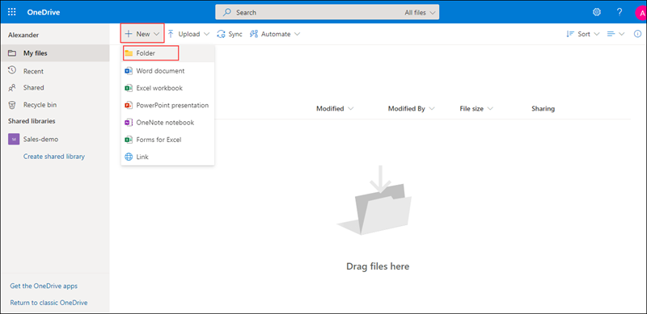

# MS-900

# Module 2: Explore Microsoft 365 Apps 

# Exercise 1: Exploring  Microsoft 365 Apps

1. Open a new browser window and login to the admin center at https://admin.microsoft.com.

1. When prompted, use the credentials provided in the **Environment Details** page to log in to the admin center.

1. Now let us explore through the **Microsoft 365 Apps**.

1. From the top right corner click on **App launcher**.
  
   

1. Under **Apps** select **outlook** and from **Open context menu** click on **Open in new tab** this will redirect you to the outlook mail.

   
   
1. In the outlook page from the left hand menu you can explore through all the options avaialbale.

   
   
1. Switch back to the account and from  **App launcher**, under **Apps** select **OneDrive** and  from **Open context menu** click on **Open in new tab** this will redirect you  to the **OneDrive** page. From here you can manage all your **files**.
   
   
   
   

1. Now we will try creating an folder and upload files into it. In the OneDrive page click on **New** icon and select **Folder** option, when prompted provide a name for your folder and select **Create**.
  
   
   
   
   
1. Now clcik on the newly create folder. From the top select **Upload** icon and select **Files**, when prompted select the **File** that you want to upload.

   
   
1. Select the new file that you have created, click on **Show actions** icon this will display the list of actions that can be performed.

   

1. You can explore through other options available in the **OneDrive** pane.

1. Switch back to the account and from  **App launcher**, under **Apps** select **Yammer** and  from **Open context menu** click on **Open in new tab** this will redirect you  to the **Yammer** page.

