# MS-900

## Module 2: Microsoft Teams for Collaboration  

  Microsoft Teams is a collaboration app that helps your team stay organized and have conversations—all in one place. With Microsoft Teams on your PC, Mac, or mobile device, you  can :
  
   * Pull together a team.
   * Use chat instead of email.
   * Securely edit files at the same time.
   * See likes, @mentions, and replies with just a single tap.
   * Customize it by adding notes, web sites, and apps. 

## Exercise 1: End User Experience 

   In this exercise, you'll learn various activities carried out in Teams such as having a Teams chat and scheduling Teams meetings.

### Task 1 : Exploring through Teams

1. Open a new browser window and login to the admin center at https://admin.microsoft.com.

1. When prompted, use the credentials provided in the **Environment Details** page to log in to the admin center.

1. From the top right corner click on **App launcher**.

1. Under **Apps** select **Teams** and from **Open context menu** click on **Open in new tab**. This will redirect you to the Teams web app page. In the Teams page click on **Use the web app instead**.

1. On the left side of **Teams** you can find: 

      - **Teams** - Find channels to belong to or create your own. Inside channels you can hold on-the-spot meetings, have conversations, and share files.

      - **Calendar** - See everything you’ve got lined up for the day or week. Or, schedule a meeting. This calendar syncs with your Outlook calendar.

      - **Calls** - In some cases, if your organization has it set up, you can call anyone from Teams, even if they’re not using Teams.

      - **Activity** - Catch up on all your unread messages, @mentions, replies, and more.

1. Now open a new browser window and login to the teams at https://teams.microsoft.com.

1. When prompted enter the username and password of the user that you created in the previous exercise.

1. In the admin teams account, search and select the newly created user from the search bar and initiate a conversation.

   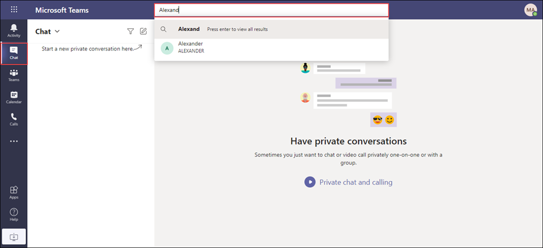

1. Now switch back to the teams user account and verify the message.

1. To create a new team from left navigation menu select **Teams**, click on **Join or create a team** and Select **Create a new team**.

   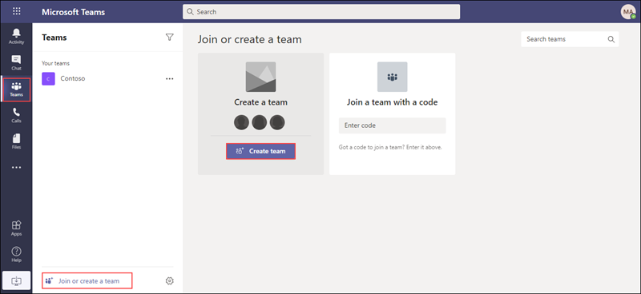

1. Select **Create a new team**, and then select **Build a team from scratch**. You can select **Create from...** to build team from an existing group respectively.
   
   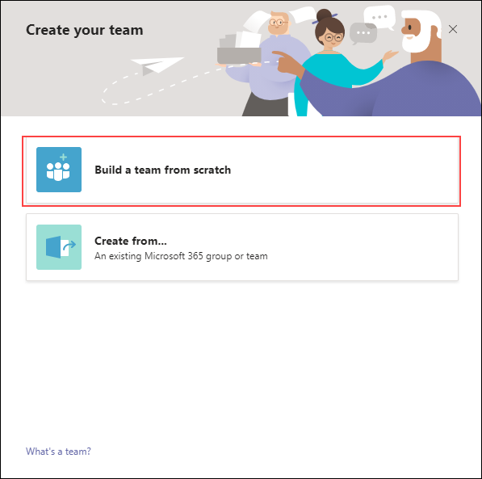

1. Select **Private** if you'd like people to request permission to join, or select **Public** if anyone in your organization can join.

    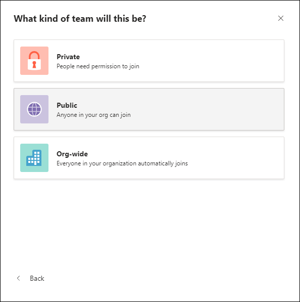

1. Give the team a name and  add description if needed. Select **Create**.

    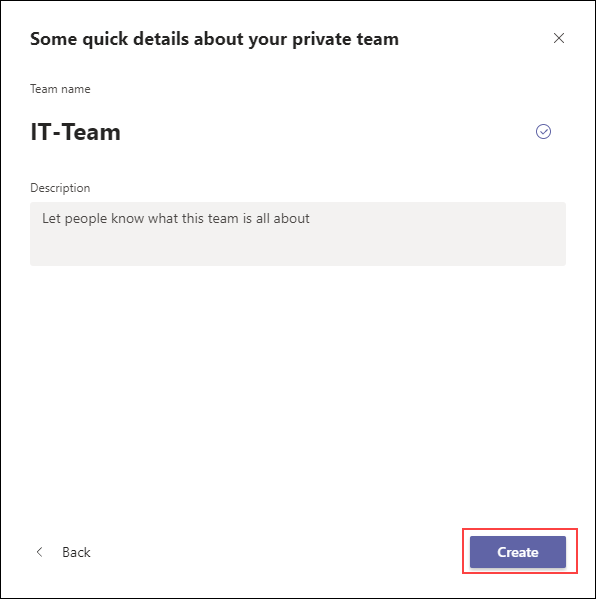

1. To Add members click on more options and select **Add members** search and select the members. When you're done adding members, select **Add** and then Close.

    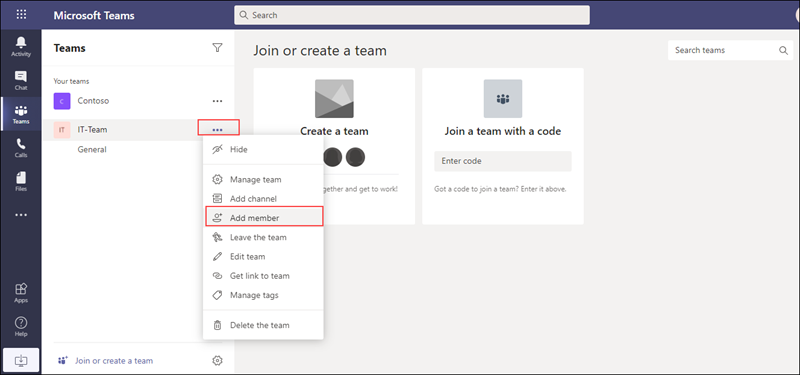

1. From here you can start a new conversation share files.

    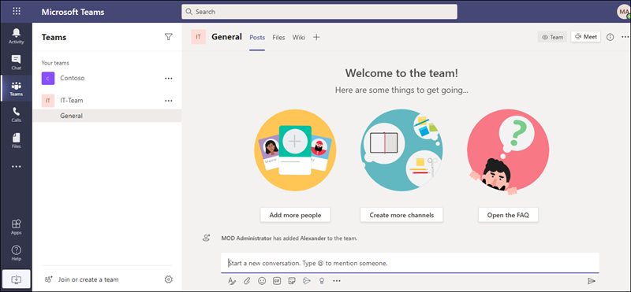

### Task 2 : Scheduling teams meeting

1. Select **calendar** from the left hand menu of the teams pane. 

1. Now click on  **New Meeting** and from the drop down select **Schedule meeting**. 
  
   
   
   - **Add Title:** Provide a name for the meeting.
   
   - **Add required attendees:** Search and select the user you created in the previous exercise.
   
   - Select date and time as per the requirements.
   
   - If it's a recurring meeting, open the dropdown menu next to **Does not repeat** (just below the date). Choose how often you want it to occur from the default options, or select Custom to create your own cadence.
   
   - If you want to have your meeting in a channel, select the appropriate channel. If you’d rather not, skip it. When you have a meeting in a channel, everyone in the team will be able to see it and join it in that channel.
   
       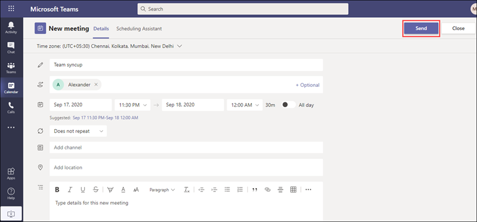
   
1. Microsoft Teams also has a **Scheduling Assistant** which you can use to find a time that works for everyone. 

1. Once done click on **Send**. This will close the scheduling form and send an invite to everyone's Outlook inbox.

1. To learn more about teams refer to https://docs.microsoft.com/en-us/MicrosoftTeams/get-started-with-teams-quick-start.
   
# Exercise 2: Explore teams admin center 

  In this exercise you will learn how to configure Teams policies and apply them.

### Task 1 :  Manage teams policies 

1. Teams policies in Microsoft Teams can be used to control what users in your organization can do in teams and channels.

1. From the Navigation menu, under **Admin centers** select **Teams**. This will redirect you to **Microsoft Teams admin center**.

   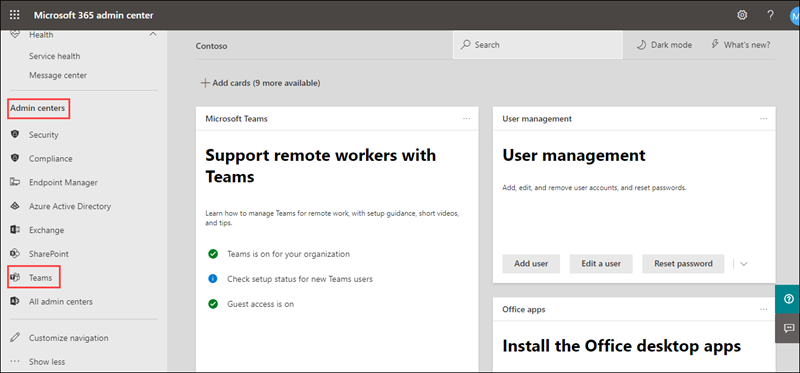
   
1. From the **Left navigation menu** select **Teams** and under it select **Manage teams**. From here you can manage all the teams and channels, create new ones, and manage the existing ones.

   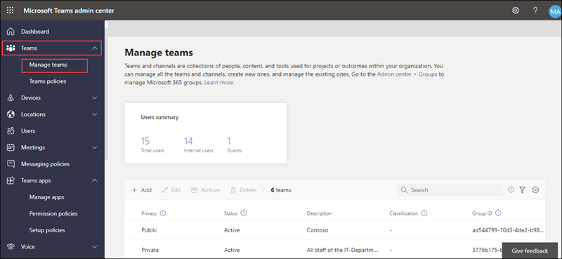

1. The Mangage teams page displays the list of your teams along with channels, users,  status of team.

1. From here you can add new team by clicking on **Add**. In **Add a new team**  page fill the deatils and click on **Apply**.

   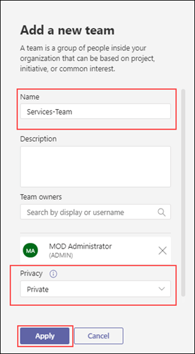

1. Click on your newly created team. From here you can add or remove **Members**, **channels** to the team and manage them.

   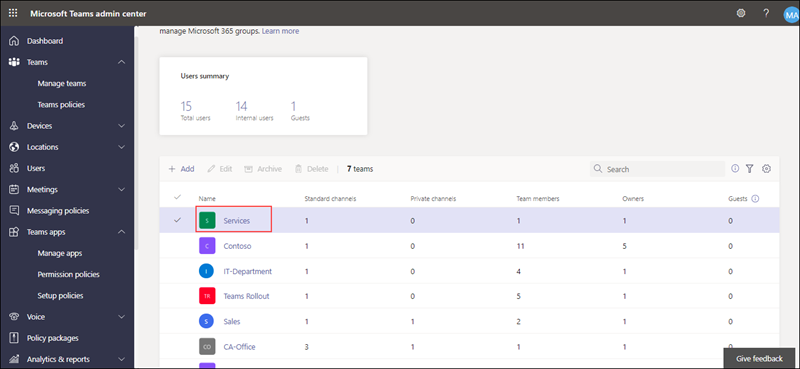
   
   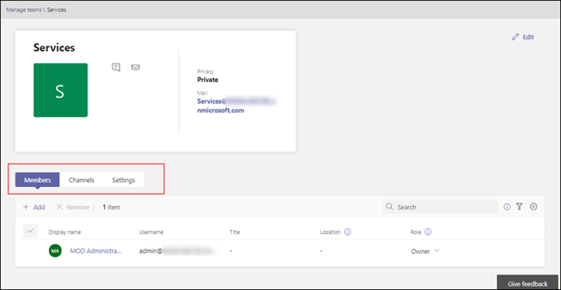

1. Now from the **Left navigation menu** select **Messagng policies**. Messaging policies are used to control which chat and channel messaging features are available to users in Microsoft Teams.

   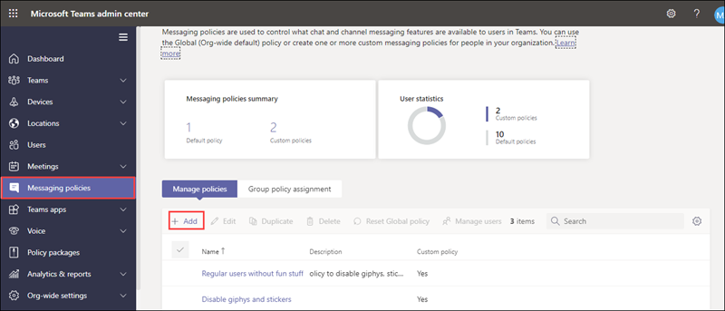

1. In the **Messaging policies** page click on **Add**. 

   - Provide a name and description for the policy.
   
   - Disable **Use Giphys in conversations** and **Delete sent messages**. You can exlpore through all the **Messaging policies** settings and select changes that you want.
   
   - Click on **Save**.
    
     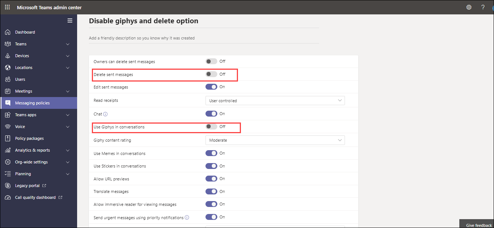
   
1. To assign a policy to the user, select the policy that you have created and click on **Manage Users**. In the search bar, search and select the user that you created previously and click on **Apply**.
 
   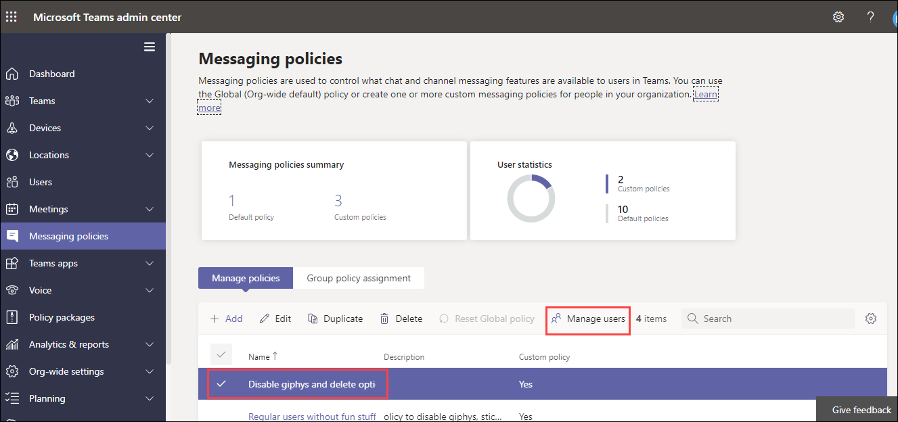
   
   

1. Switch back to user's teams portal and in the chat notice **Delete** option is not available.

1. In the left navigation of the Microsoft Teams admin center, select **Teams apps**  and select **Permission policies**. From here you can configure App permission policies. App permission policies control what apps you want to make available to Teams users in your organization.

   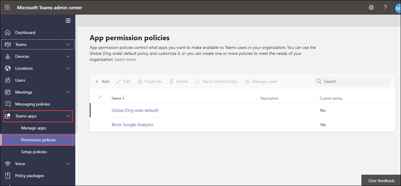

1. Click on **Add**. Enter a name and description for the policy.

1. Under **Microsoft apps** select **Allow specific apps and block all others**. You can also select other options based on your requirement.

    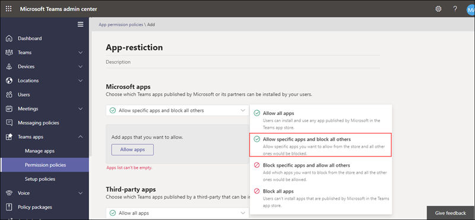

1. Select **Allow apps**, search for the apps that you want to allow, and then click **Add**.

    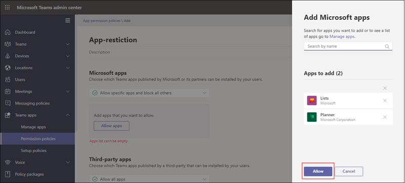

1. Similarly, repeat the above steps for **Third-party apps**, **Custom apps**. When done click **Save**.

    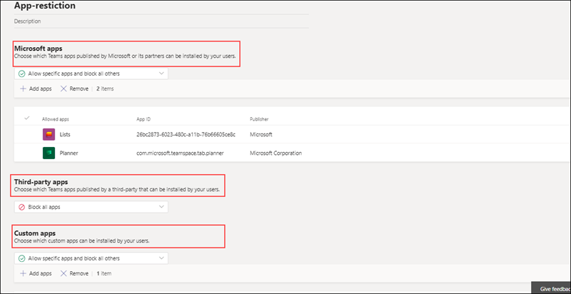

1. To apply this policy to specific users select your newly created policy, click on **Manage users** in the search bar search and select the users or groups to whom you intend to apply this policy. Select **Apply**.

1. To learn more about teams policies refer to https://docs.microsoft.com/en-us/microsoftteams/assign-policies.

## Conclusion

  In this module you learnt how to work with Teams policies and use Teams for collabration.
   

