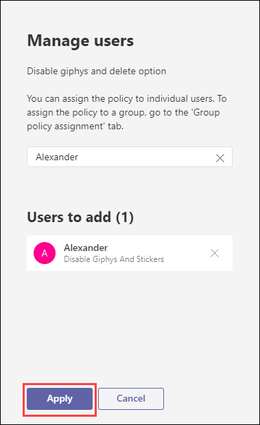

# MS-900

## Module 2: Microsoft Teams for Collaboration  

  Microsoft Teams is a collaboration app that helps your team stay organized and have conversations—all in one place. With Microsoft Teams on your PC, Mac, or mobile device, you  can :
  
   * Pull together a team.
   * Use chat instead of email.
   * Securely edit files at the same time.
   * See likes, @mentions, and replies with just a single tap.
   * Customize it by adding notes, web sites, and apps. 

## Exercise 1: End User Experience 

### Task 1 : Exploring through teams

1. Open a new browser window and login to the admin center at https://admin.microsoft.com.

1. When prompted, use the credentials provided in the **Environment Details** page to log in to the admin center.

1. From the top right corner click on **App launcher**.

1. Under **Apps** select **Teams** and from **Open context menu** click on **Open in new tab**. This will redirect you to the Teams web app page. In the Teams page click on **Use the web app instead**.

1. Now open a new browser window and login to the admin center at [https://admin.microsoft.com](https://go.microsoft.com/fwlink/p/?linkid=2024339).

1. When prompted enter the username and password of the user that you created in the previous exercise.

1. In the admin teams account, search and select the newly created user from the search bar and initiate a conversation.

   

1. Now switch back to the teams user account and verify the message.

### Task 2 : scheduling teams meeting

1. Select **calendar** from the left hand menu of the teams pane. 

1. Now click on  **New Meeting** and from the drop down select **Schedule meeting**. 
  
   
   
   - **Add Title:** Provide a name for the meeting.
   
   - **Add required attendees:** Search and select the user you created in the previous exercise.
   
   - Select date and time as per the requirements.
   
   - If it's a recurring meeting, open the dropdown menu next to **Does not repeat** (just below the date). Choose how often you want it to occur from the default options, or select Custom to create your own cadence.
   
   - If you want to have your meeting in a channel, select the appropriate channel. If you’d rather not, skip it. When you have a meeting in a channel, everyone in the team will be able to see it and join it in that channel.
   
       
   
1. Microsoft Teams also has a **Scheduling Assistant** which you can use to find a time that works for everyone. 

1. Once done click on **Send**. This will close the scheduling form and send an invite to everyone's Outlook inbox.
   
# Exercise 2: Explore teams admin center 

### Task 1 :  Manage teams policies 

1. Teams policies in Microsoft Teams can be used to control what users in your organization can do in teams and channels.

1. From the Navigation menu, under **Admin centers** select **Teams**. This will redirect you to **Microsoft Teams admin center**.

   

1. Now from the **Left navigation menu** select **Messagng policies**. Messaging policies are used to control which chat and channel messaging features are available to users in Microsoft Teams.

   

1. In the **Messaging policies** page click on **Add**. 

   - Provide a name and description for the policy.
   
   - Disable **Use Giphys in conversations** and **Delete sent messages**. You can exlpore through all the **Messaging policies** settings and select changes that you want.
   
   - Click on **Save**.
    
     
   
1. To assign a policy to the user, select the policy that you have created and click on **Manage Users**. In the search bar, search and select the user that you created previously and click on **Apply**.
 
   
   
   

1. Switch back to user's teams portal and in the chat notice **Delete** option is not available.

   
   

