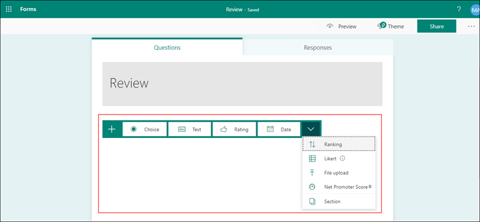
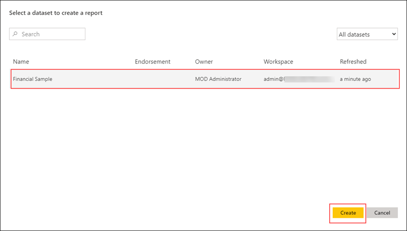
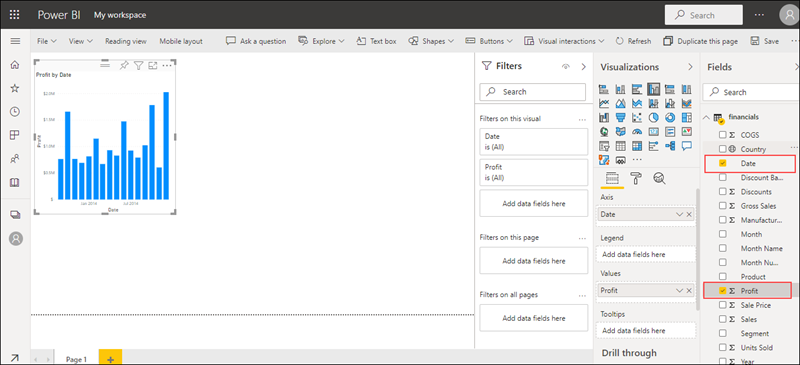
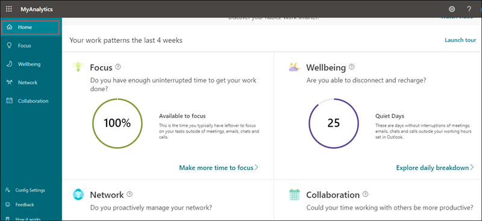
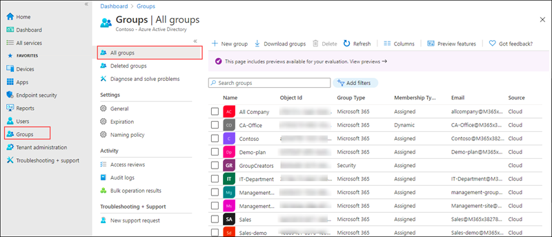

# Module 3 : M365 Business Management Capabilities 

 In this module you will learn to work with M365 groups, Microsoft Planner, Forms, Power BI. You will also explore through Microsoft Endpoint Manager.

# Exercise 1: Types of Groups in M365 

1. In the Groups section of the Microsoft 365 admin center, you can create and manage diffrent types of groups:

   - **Microsoft 365 group** :  Microsoft 365 groups are used for collaboration between users, both inside and outside your company. With each Microsoft 365 group, members get a group email and shared workspace for conversations, files, and calendar events, and a Planner.
   
   - **Distribution** : Distribution groups are used for sending notifications to a group of people. They can receive external email if enabled by the administrator.
   Distribution groups are best for situations where you need to broadcast information to a set group of people.
   
   - **Mail-enabled security** : These groups are used for granting access to resources such as SharePoint, and emailing notifications to those users.
   
   - **Security groups** : They can be used for granting access to resources such as SharePoint sites. They can make administration easier because you need to only administer the group rather than adding users to each resource individually.
   
# Exercise 2: Create M365 Groups

  In this exercise you will learn how to create groups and add members to it from admin center.

### Task 1 : Create Office 365 Groups

1. From the navigation menu click on **Groups** icon and click on **Active groups**, now select **Add a group** icon.

   
    
1. On the Choose a group type page, select **Office 365**, and click on **Next**.

   

1. On the Basics page, type a name for the group and a description(optional). Click **Next**.

   

1. In the **Owners** page, choose the name of one or more people who will be designated to manage the group. Anyone who is a group owner can add or remove members and have unique permissions like the ability to delete conversations from the shared inbox or change different settings about the group. Click **Next**.
 
   
   
1. Now in the **Settings** page, type a unique email address for the group, choose a privacy option based on your requirement and whether you want to add Microsoft Teams for group, and then click **Next**.

   

1. Review your settings and make any changes if needed, select **Create group** and then **close**.

   

1. In the admin center, select the name of the group that you want to add members to. Refresh the page if your not able to see newly created group.

1. To add members to the group, navigate to the **Members tab** and select **View all and manage members**.

   
   
1. Click on **Add members**, select the users you want to add, and then click on **Save**.

   
   
1. To learn more about groups refer to https://docs.microsoft.com/en-us/microsoft-365/admin/create-groups.

# Exercise 3 : Explore Microsoft Planner 

1. Microsoft Planner provides a hub for team members to create plans, organise and assign tasks to different users and to check updates on progress through dashboards. It also provides a centralised place where files can be shared and gives visibility to the whole team.

1. From the top right corner of admin center click on **App launcher**.

1. Under **Apps** select **Planner** and from **Open context menu** click on **Open in new tab**. This will redirect you to the Microsoft Planner  web page.

1. Select **New plan**  in the left pane.
 
   

1. In the **New plan** window: 
    
    - Enter a name for the plan
    
    - Make the plan public if you want it to be visible to the rest of your organization and in search results, or make it private if you want only plan members to see it.
    
    - Click on **Add to an existing Microsoft 365 Group** to create your plan in exisiting group or if needed you can create a new group.
    
    - Select **Create plan**.
    
       

1. Now to add members to the plan, from the upper-right corner of the Planner window click on **Members**.

   

1. Search the name or email address of a person within your organization that you want to add to the plan and select the person's card when it appears.

1. Now to create bucket click on **Add new bucket**. Buckets helps to organize tasks into things like workstreams, project phases, or topics. 

   

1.  Type a name for the bucket, and then press Enter.

1. Select **Add task** below the heading of the bucket to which you want to add a task.
    
    - Provide a task name
    
    - Select a due date for the task
    
    - Click on **Assign** and choose a plan member from the list. If the right person isn't listed, type a name or email address in the search box to add someone new.
    
       
 
 1. Click on the task to open the task window. 
 
 1. Select **Start anytime** below Start date, and then select the start date you want. Select **Due anytime** below Due date, and then select the due date you want.
 
    
     
 1. In task window select **Priority**  from here you can set priority of the task.
 
    
 
 1. Select **Add attachment**. Select **File** to attach a locally stored file, select **Link** to include a link, or select **SharePoint** to attach a file from a SharePoint site.
 
    
 
 1. Navigate to and select the file you want to attach, or enter the link information.

1. You can also add comments in **Comment** section. When done click on dismiss button in the upper-right corner of the task window to save and close the task.

1. Now select **Charts**. The charts show how your plan is progressing, with details about what’s done, in progress, not started, and late.

    

1. To learn more about planner refer to https://support.microsoft.com/en-us/planner.

# Exercise 4 : Setup Microsoft Forms 

  This exercise explains how to create and work with Microsoft Forms.
 
### Task 1 : Creating a new form

1. With Microsoft Forms, you can create surveys, quizzes, and polls, and easily see results as they come in.

1. From the top right corner click on **App launcher**

1. Under **Apps** select **outlook** and from **Open context menu** click on **Open in new tab**. This will redirect you to the Microsoft Forms  web page.

1. Select **New Form** to begin creating your form.

   

1. Enter a name for your form, you can also enter description if needed.

1. Click **Add New** to add a new question to the form. 

   

1. Choose from Choice, Text, Rating, or Date questions. You can also click More question types Drop down list for more question types in Microsoft Forms to select Ranking, Likert, File upload, or Net Promoter Score® questions. 

   

1. For now select **Choice**. Enter the text you want to display for the question and each of the choices. Click **Add Option** to add more choices than the default two choices.

1. Click **Add New** to add more questions to your form. Now select **Text**.

1. For text questions, select the **Long Answer** option if you want a larger text box displayed on the form.

1. Text questions also allow you to set restrictions when you need to have numbers as the answer. For this cick on **More options** button , and then select **Restrictions**.
    
   
   
   
  
1. Now from the drop down select **Between** and enter the number. You can choose to restrict the numbers by selecting from the various options such as Greater than, Less than, Between, and many others.
   
   

1. Click Preview at the top of the design window to see how your form will look on a computer. Now  to test your form, enter answers for the questions in preview mode and then click on **Submit**.

   
   
   

1. Now click on **Back** and select the **Responses tab**. From here you can see summary information data about your form, such as number of responses and average time it took for respondents to complete your form.

   

### Task 2 : Change a form theme and Sharing forms

1. Click on the **Theme** at the top right of the design window and pick the color or background you want.

   

1. If you prefer to customize theme, with  in the theme page scroll down and select **+ Customize theme** button. From here you can either upload a  image by clicking on **Upload image** icon or customize color of your choice by clicking on **Customize color** button.

   

1. From the top navigation menu click on **Share**. From here based on your requirement you can either use link, QR code, Embed or Email option to share your form.

   
   
1. To know more about forms refer https://support.microsoft.com/en-us/forms.

# Exercise 5 : Setup Basic PowerBI Report from a sample Excel 

  In this exercise you will learn how to create a Power BI report from sample data and visualize it.

### Task 1: Import data to PowerBI

1. From the top right corner of admin center click on **App launcher**

1. Under **Apps**, select **Power BI** and from **Open context menu** click on **Open in new tab**. This will redirect you to the Microsoft **Power BI** web page.

1. Download sample data from https://docs.microsoft.com/en-us/power-bi/create-reports/sample-financial-download

   
   
1. In Power BI, from left navigation menu select **My workspace**, click on **New** and from the drop down select **Upload a file**.

   

1. Select **Local File**, browse to where you saved the Financial Sample data file, and click on **Open**.

   

1. On the **Local File page**, select **Import**.

1. Now to create a report. With in **My workspace** select **New** and from the drop down select **Report**.

1. In the **Select a dataset to create a report** dialog box, select your **Financial Sample dataset** and click on **Create**.

   

### Task 2 : Visualize data

1. The report opens in Editing view and displays the blank report canvas. On the right are the **Visualizations**, **Filters**, and **Fields** panes.

   

1. Now let us create visualizations. Let's say your manager wants to see profit over time. To do this, in the Fields pane select **Profit**. Power BI displays a column chart with one column.

   

1. From Fields pane, select **Date**. Power BI updates the column chart to show profit by date. 

   

1. We can also create  a map visualization. In this we will check which countries are the most profitable.

1. Select a blank area on your report canvas, from the **Fields** pane, select **Country** and **Profit** field. Power BI creates a map visual with bubbles representing the relative profit of each location.

   

1. In this way you can explore through other visualization options.

1. To save your report from the top navigation menu, select **File** and click on **Save**, provide a name for your report and select **Save**.

   

1. To learn more about **Power BI** refer to https://docs.microsoft.com/en-us/power-bi/fundamentals/power-bi-overview.

# Exercise 6 : Explore MyAnalytics

1. Microsoft MyAnalytics, formerly Delve Analytics, is an application designed to help employees and their managers gain insight into how workers spend their time, with the goal of optimizing tasks and making them more efficient. With this application you can track data such as time spent in meetings, Outlook emails, productivity and time spent working late.

1. From the top right corner of admin center click on **App launcher**

1. Under **Apps**, select **MyAnalytics** and from **Open context menu** click on **Open in new tab**. This will redirect you to the Microsoft **MyAnalytics** web page.

1. From the left navigation menu select **Home**. This displays statistics about your work patterns over the past month, including your focus and collaboration time, how many days you were able to disconnect from work, and how effectively you are networking with your coworkers.

   

1. From the left navigation menu select **Focus**. The Focus page shows weekly averages for the time you have available to focus and time spent collaborating with others in your network.
   
   

1. Select **Wellbeing** this page shows how well you are disconnecting from work during your time off and suggests ways to reduce stress and burnout.
   
   

1. Select **Network** this page shows how many people you actively connect with in the last month and gives you suggestions on how to improve connections with your most important contacts, such as your manager or your direct reports.

   

1. Select **Collaboration** this helps you reflect on how effectively you spend your time in meetings, email, chats, and calls.

   - **Weekly average** : The Weekly average section shows an estimate of how much time you spent in meetings, email, chats, and calls in the past four weeks. 
   
   - **Meeting habits** : The Meeting habits view shows data about your meeting habits based on the meetings on your calendar over the past four weeks. It helps you understand the number of times each of these meeting types occur out of the total number of meetings you organized or accepted to attend.
   
   - **Communication habits** : The Communication habits section shows the total number of chats (instant messages) and emails sent and read during each hour of the day in the past four weeks.
   
     

1. To learn more about **MyAnalytics** refer to https://docs.microsoft.com/en-us/workplace-analytics/myanalytics/mya-landing-page.

# Exercise 7 : Explore Microsoft EndPoint Manager 

1. Microsoft Endpoint Manager helps deliver the modern workplace and modern management to keep your data secure, in the cloud and on-premises. Endpoint Manager includes the services and tools you use to manage and monitor mobile devices, desktop computers, virtual machines, embedded devices, and servers. Endpoint Manager combines services like Microsoft Intune, Configuration Manager, Desktop Analytics, co-management, and Windows Autopilot.

1. From the navigation menu scroll down to Admin centers and select **Endpoint Manager**. This will redirect you to Endpoint Manager admin center.

   

1. From the navigation pane, select **Dashboard** to display overall details about the devices and client apps in your Intune tenant.

   

1. Microsoft Intune is a cloud-based service that focuses on mobile device management (MDM) and mobile application management (MAM). Intune is part of Microsoft's Enterprise Mobility + Security (EMS) suite.

1. From the navigation pane, select **Devices**  to display details about the enrolled devices in your Intune tenant.

1. The Devices, **Overview** pane has several tabs that allow you to view a summary of the following statuses and alerts:

      -  **Enrollment status** - Review details about Intune enrolled devices by platform and enrollment failures.
      
      -  **Enrollment alerts** - Find more details about unassigned devices by platform.

      -  **Compliance status** - Review compliance status based on device, policy, setting, threats, and protection. Additionally, this pane provides a list of devices without a compliance policy.

      - **Configuration status** - Review configuration status of device profiles, as well as profile deployment.
      
      - **Software update status** - See a visual of the deployment status for all devices and for all users.
      
        

1. From the Devices **Overview** pane, select **Compliance policies**  to display details about compliance policies for devices managed by Intune. Compliance requirements are essentially rules, such as requiring a device PIN, or requiring device encryption. Device compliance policies define the rules and settings that a device must follow to be considered compliant.

   

1. From the Devices Overview pane, select **Conditional Access** this display details about access policies. Conditional Access refers to ways you can control the devices and apps that are allowed to connect to your email and company resources.

   

1. From the navigation pane, select Devices  and select **Configuration profiles** to display details about device profiles in Intune. 

   

1. From here you can configure device restriction settings like Allow or block the device camera, control access to Google Play, app stores, viewing documents, and gaming, and much more.

1. In the  **Devices** page select **All devices** to display details about your Intune tenant's enrolled devices. This list of devices show key details about compliance, OS version, and last check-in date. 

   
  
1. From the navigaton pane select **Apps**. In apps page select **All apps** this displays list of apps that have been added to Intune. You can add a variety of different app type based on platform to Intune. Once an app has been added, you can assign it to groups of users.

   

1. From the navigation pane, select **Users** to display details about the users that you have included in Intune.

   

1. From the navigation pane, select **Groups** to display details about the Azure Active Directory (Azure AD) groups included in Intune. As an Intune admin, you use groups to manage devices and users.

   
   
1. To learn more about Endpoint Manager refer to https://docs.microsoft.com/en-us/mem/intune/fundamentals.

## Conclusion

With the help of this module you learnt how to create M365 groups, forms, plans and assign tasks using Planner, also visualized a sample data using Power BI and explored through EndPoint Manager

