# Module 4 : M365 Business Management Capabilities 

# Exercise 1: Types of Groups in M365 

1.In the Groups section of the Microsoft 365 admin center, you can create and manage diffrent types of groups:

   - **Microsoft 365 group** :  Microsoft 365 groups are used for collaboration between users, both inside and outside your company. With each Microsoft 365 group, members get a group email and shared workspace for conversations, files, and calendar events, and a Planner.
   
   - **Distribution** : Distribution groups are used for sending notifications to a group of people. They can receive external email if enabled by the administrator.
   Distribution groups are best for situations where you need to broadcast information to a set group of people.
   
   - **Mail-enabled security** : These groups are used for granting access to resources such as SharePoint, and emailing notifications to those users.
   
   - **Security groups** : They can be used for granting access to resources such as SharePoint sites.They can make administration easier because you need to only administer the group rather than adding users to each resource individually.
   
# Exercise 2: Create M365 Groups

### Task 1 : Create Office 365 Groups

1. From the navigation menu click on **Groups** icon and click on **Active groups**, now select **Add a group** icon.

   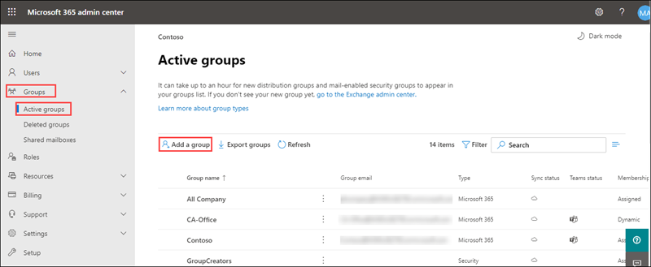
    
1. On the Choose a group type page, select **Office 365**, and select **Next**.

   

1. On the Basics page, type a name for the group and a description(optional). Select **Next**.

   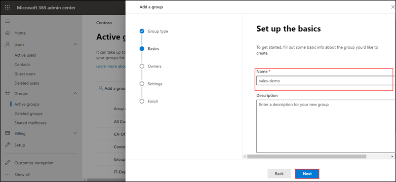

1. In the Owners page, choose the name of one or more people who will be designated to manage the group. Anyone who is a group owner can add or remove members and have unique permissions like the ability to delete conversations from the shared inbox or change different settings about the group. Select **Next**.
 
   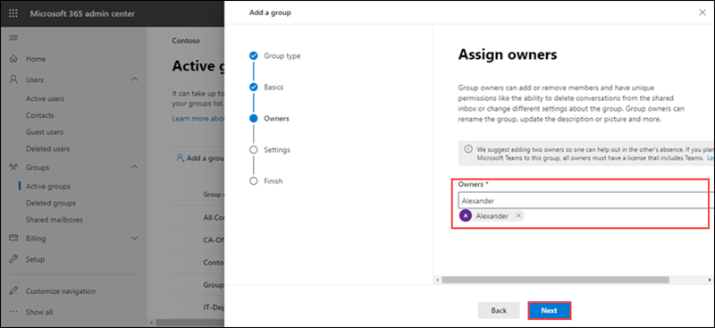
   
1. Now in the **Settings** page, type a unique email address for the group, choose a privacy option based on your requirement and whether you want to add Microsoft Teams for group, and then selec **Next**.

   

1. Review your settings and making any changes if needed, select **Create group** and then select **close**.

   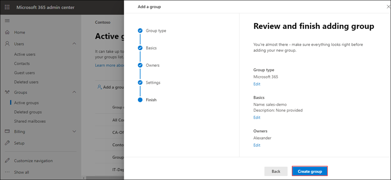

1. In the admin center, select the name of the group that you want to add members to. Refresh the page if your not able to see newly created group.

1. To add memmbers to the group, navigate to the **Members tab** and select **View all and manage members**.

   
   
1. Click on **Add members**, select the users you want to add, and then select **Save**.

   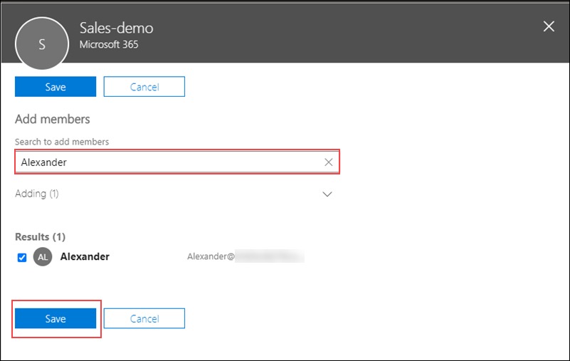

# Exercise 3 : Explore Microsoft Planner 

1. Microsoft Planner provides a hub for team members to create plans, organise and assign tasks to different users and to check updates on progress through dashboards. It also provides a centralised place where files can be shared and gives visibility to the whole team.

1. From the top right corner of admin  center click on **App launcher**

1. Under **Apps** select **Planner** and from **Open context menu** click on **Open in new tab** this will redirect you to the Microsoft Planner  web page.

1. Select **New plan**  in the left pane.
 
   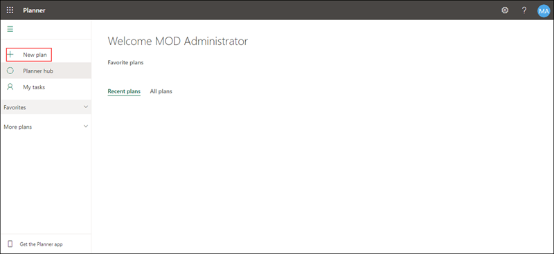

1. In the New plan window: 
    
    - Enter a name for the plan
    
    - Make the plan public if you want it to be visible to the rest of your organization and in search results, or make it private if you want only plan members to see it.
    
    - Click on **Add to an existing Microsoft 365 Group** to create your plan in exisiting group or if needed you can create a new group.
    
    - Select **Create plan**.
    
       

1. Now to add memmbers to the plan, from the upper-right corner of the Planner window click on **Members**

   

1. Search the name or email address of a person within your organization that you want to add to the plan and select the person's card when it appears.

1. Now to assing task to people click on **Add task** 
    
    - Provide a task name
    
    - Select a due date for the task
    
    - Click on **Assign** and choose a plan member from the list. If the right person isn't listed, type a name or email address in the search box to add someone new.
    
       

# Exercise 4 : Setup Microsoft Forms 

### Task 1 : Creating a new form

1. With Microsoft Forms, you can create surveys, quizzes, and polls, and easily see results as they come in.

1. From the top right corner click on **App launcher**

1. Under **Apps** select **outlook** and from **Open context menu** click on **Open in new tab** this will redirect you to the Microsoft Forms  web page.

1. Select **New Form** to begin creating your form.

   

1. Enter a name for your form, you can also enter description if needed.

1. Click **Add New** to add a new question to the form. 

   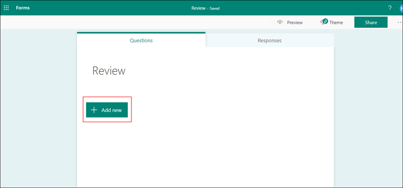

1. Choose from Choice, Text, Rating, or Date questions. You can also click More question types Drop down list for more question types in Microsoft Forms to select Ranking, Likert, File upload, or Net Promoter Score® questions. 

   

1. For now select **Choice**.Enter the text you want to display for the question and each of the choices. Click **Add Option** to add more choices than the default two choices.

   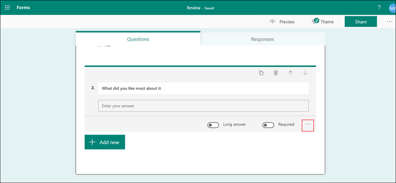

1. Click **Add New** to add more questions to your form. Now select **Text**.
 
   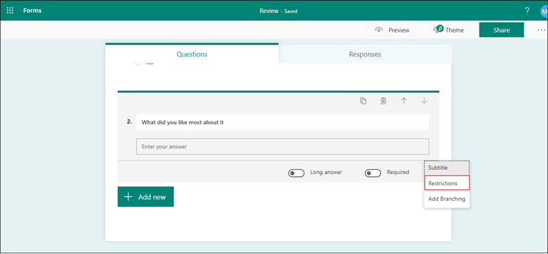

1. For text questions, select the **Long Answer** option if you want a larger text box displayed on the form.

1. Text questions also allow you to set restrictions when you need to have numbers as the answer.Click on **More settings for question More options** button , and then select **Restrictions**
  
  

1. Now from the drop down select **Between** and enter the number. You can choose to restrict the numbers by selecting from the various options such as Greater than, Less than, Between, and many others.

1. Click Preview at the top of the design window to see how your form will look on a computer. Now  to test your form, enter answers for the questions in preview mode and then click **Submit**.

   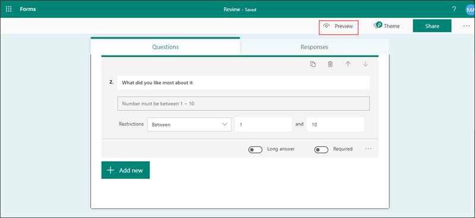
   
   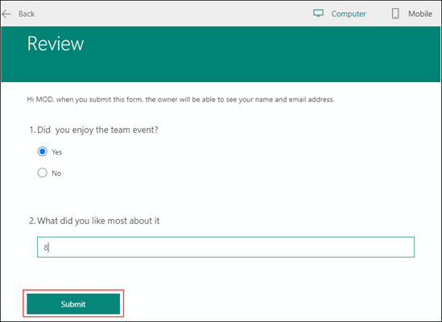

1. Now click on **Back** and select the **Responses tab**. From here you can see summary information data about your form, such as number of responses and average time it took for respondents to complete your form.

   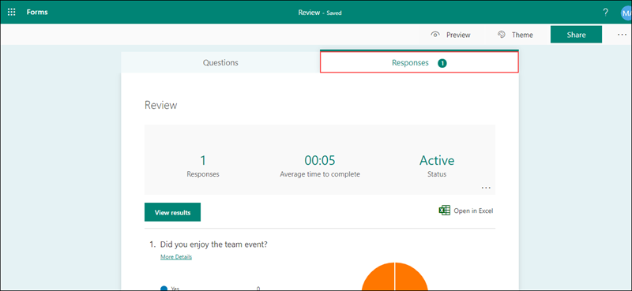

### Task 2 : Change a form theme and Sharing forms

1. Click on the **Theme** at the top right of the design window and pick the color or background you want.

1. If you prefer to customize theme, with  in the theme page scroll down and select **+ Customize theme** buttton. From here you can either upload a  image by clicking on **Upload image** icon or customize color of your choice by clicking on **Customize color** button.

1. From the top navigation menu click on **Share**. From here based on your requirement you can either use link, QR code, Embed or Email option to share your form.

# Exercise 5 : Setup Basic PowerBI Report from a sample Excel 

### Task 1: Import data to PowerBI

1. From the top right corner click on **App launcher**

1. Under **Apps** select **Power BI** and from **Open context menu** click on **Open in new tab** this will redirect you to the Microsoft **Power BI**  web page.

1. Download sample data from https://docs.microsoft.com/en-us/power-bi/create-reports/sample-financial-download

1. In Power BI from left navigation menu select **My workspace**, select **New** and from the drop down select **Upload a file**.

1. Select **Local File**, browse to where you saved the Financial Sample Excel file, and select **Open**.

1. On the **Local File page**, select **Import**.

1. Now to create a report. With in **My workspace** select **New** and from the drop down slect **Report**.

1. In the **Select a dataset to create a report** dialog box, select your **Financial Sample dataset** and click on **Create**.

### Task 2 : Visualize data

1. The report opens in Editing view and displays the blank report canvas. On the right are the **Visualizations**, **Filters**, and **Fields** panes.

1. Now let us create visualizations. Let's say your manager wants to see profit over time. In the Fields pane, select **Profit**. Power BI displays a column chart with one column.

1. From Fields pane, select **Profit**. Power BI updates the column chart to show profit by date. 

1. We can also create  a map visualization. In this we will check which countries are the most profitable.

1. Select a blank area on your report canvas, from the **Fields** pane, select **Country** and **Profit** field. Power BI creates a map visual with bubbles representing the relative profit of each location.

1. In this way you can explore through other visualization options.

1. To save your report from the top navigation menu select **File** and click on **Save** provide a name for your report and select **Save**.

# Exercise 5 : Explore Microsoft EndPoint Manager 

         
     

     

