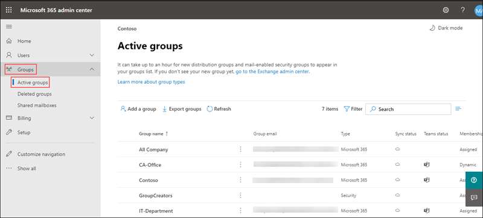

# Module 4 : M365 Business Management Capabilities 

# Exercise 1: Types of Groups in M365 

### Task 1: Microsoft 365

1. Microsoft 365 groups are used for collaboration between users, both inside and outside your company. With each Microsoft 365 group, members get a group email and shared workspace for conversations, files, and calendar events, and a Planner.

1. Open a new browser window and login to the admin center at [https://admin.microsoft.com](https://go.microsoft.com/fwlink/p/?linkid=2024339).

1. When prompted, use the credentials provided in the **Environment Details** page to log in to the admin center.

1. From the navigation menu click on **Groups** icon and click on **Active groups**, now select **Add a group** icon.

   
   
1. On the Choose a group type page, select **Office 365**, and select **Next**.

1. On the Basics page, type a name for the group and a description(optional). Select **Next**.

1. In the Owners page, choose the name of one or more people who will be designated to manage the group. Anyone who is a group owner can add or remove members and have unique permissions like the ability to delete conversations from the shared inbox or change different settings about the group. 

1. Select **Next**.

1. Now in the **Settings** page, type a unique email address for the group, choose a privacy option based on your requirement and whether you want to add Microsoft Teams for group, and then selec **Next**.

1. Review your settings and making any changes if needed, select **Create group** and then select **close**.

1. In the admin center, select the name of the group that you want to add members to. Refresh the page if your nt able to see newly created group.

1. To add memmbers to the group, navigate to the **Members tab** and select **View all and manage members**.

1. Click on **Add members**, select the users you want to add, and then select **Save**.

