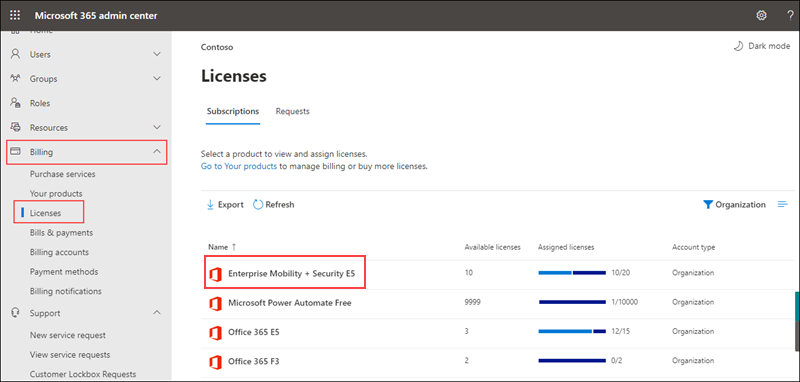
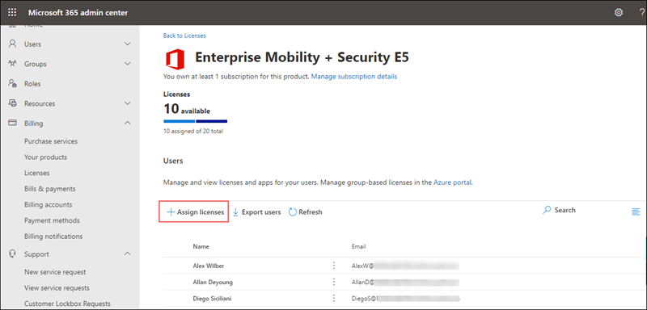
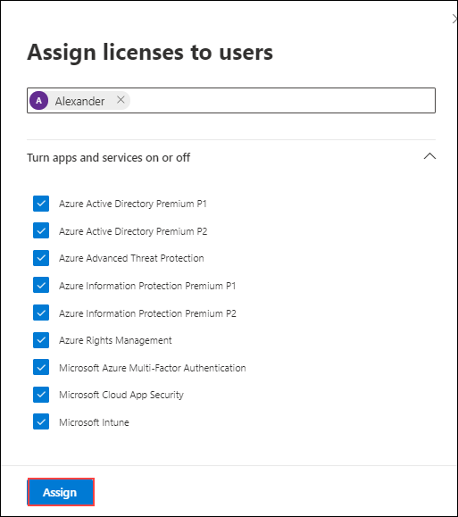
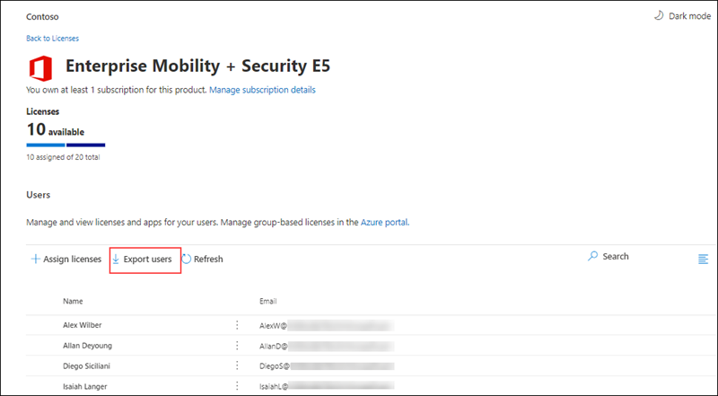
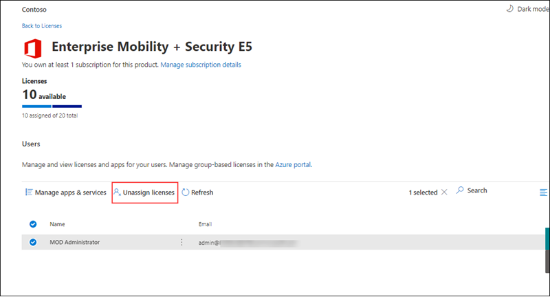
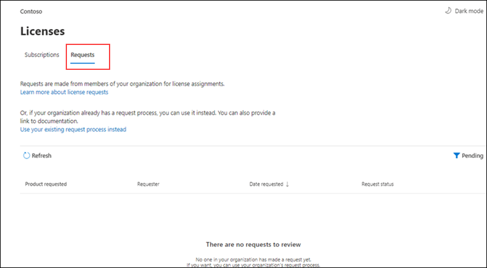

# MS-900

# Module 5: Licensing 

  In this module you will browse through licensing center and learn how to assign license to users from Microsoft 365 Admin center.

# Exercise 1: Browse Licensing center in M365 Admin center 

1. Open a new browser window and login to the admin center at [https://admin.microsoft.com](https://go.microsoft.com/fwlink/p/?linkid=2024339).

1. When prompted, use the credentials provided in the **Environment Details** page to log in to the admin center.

1. From  the navigation menu scroll down to  **Billing** and select **Licenses**.
   
1. In the Subscriptions page you can see all Available licenses, Assigned licenses. Click on any of the product to get detailed information.

   

1. This displays the list of users to whom the selected license is assigned. From here you can assign license to users.

1. Click on **Assign licenses**.

   

1. In the **Assign licenses to users** pane, begin typing a name, and then choose it from the results to add it to the list. You can add up to 20 users at a time.

1. Select **Turn apps and services on or off** to assign or remove access to specific items.
   
   

1. When you're finished, select **Assign**, then select Close.

1. You can export the list of all users assigned with this license by clicking on **Export users**.

   

1. To Unassign licenses, Select the users for which you want to unassign licenses.

1. Select **Unassign licenses**. In the Unassign licenses box, select Unassign.

   

1. Now in the licenses page click on **Requests**. From here you can approve or deny the requests made from members of your organization for license assignments.

    

1. To learn more about licenses refer to  https://docs.microsoft.com/en-us/microsoft-365/commerce/licenses

