# MS-900

# Module 5: M365 Security and Compliance 

# Exercise 1: Azure AD Security 

### Task 1: Enable MFA in AAD using Conditional Access Policy 

1. Open a new browser window and login to the admin center at [https://admin.microsoft.com](https://go.microsoft.com/fwlink/p/?linkid=2024339).

1. When prompted, use the credentials provided in the **Environment Details** page to log in to the admin center.

1. From  the navigation menu scroll down to  **Admin centers** and select **Azure Active Directory**, the Azure Active Directory overview page will appear.

   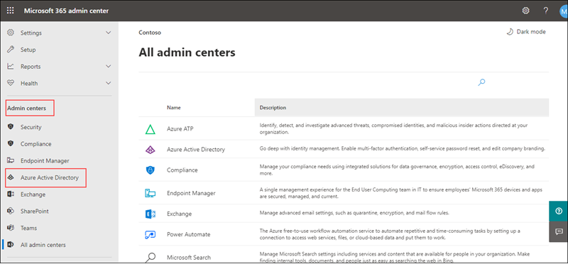

1. On the left side of the page scroll down to the **Security**.

   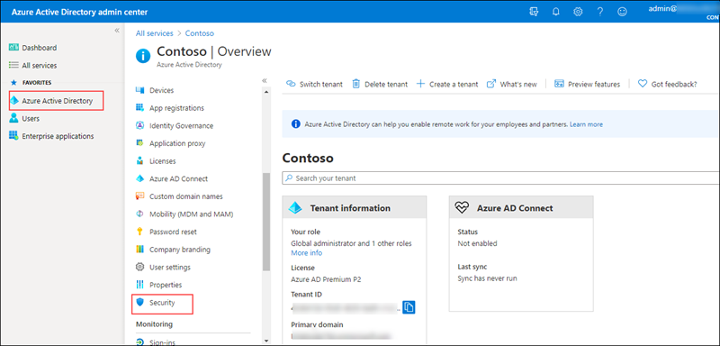

1. In the **Security** page select **Conditional access**.

   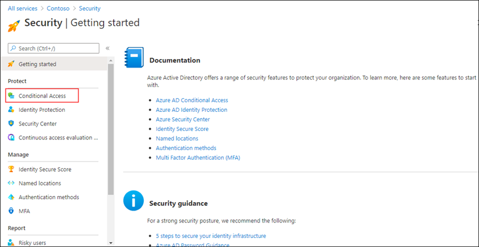

1. At the top of the Policies pane, click **+ New Policy**. 

   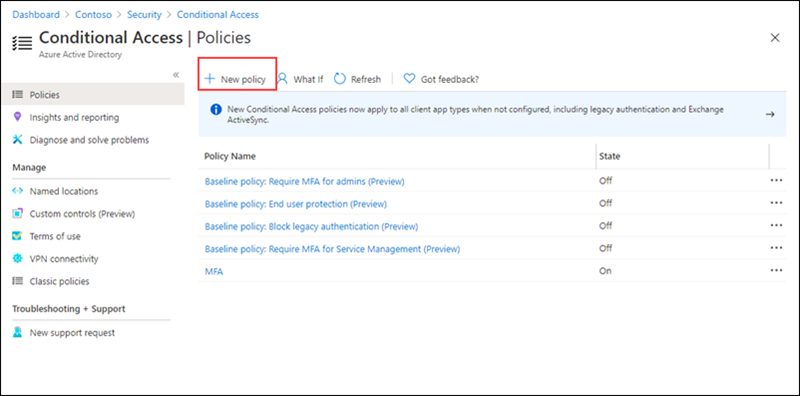

1. Provide a name for your policy. Under Assignments, select **Users and groups**. In Include tab, select **Users and groups**. In the search bar search  and select the user's you intend to enable MFA and click on **Select**.

   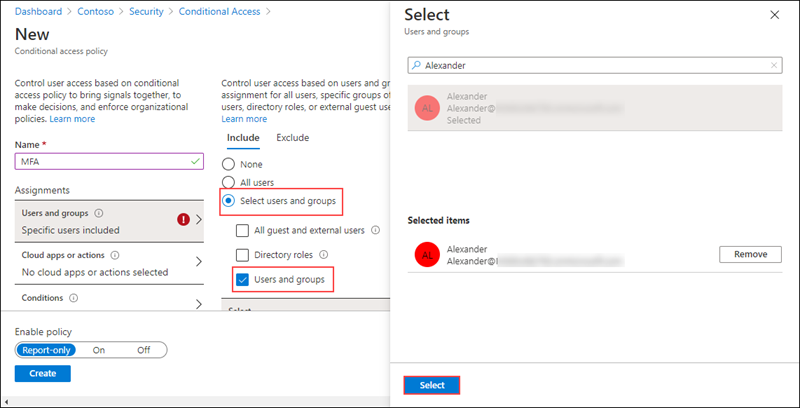

1. Under **Cloud apps**, click on **Select Apps** and select the apps for which you intend to apply policy.

   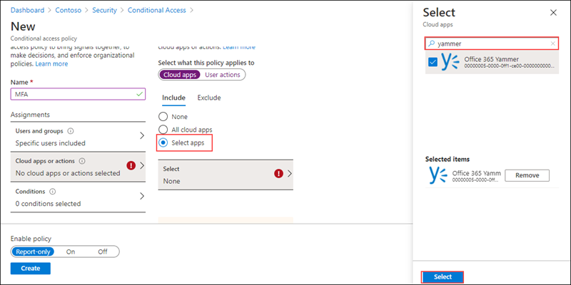

1. Now under **Access controls** select **Grant**, and then select **Grant access**, check the **Require multi-factor authentication** checkbox, and click on **select**.

   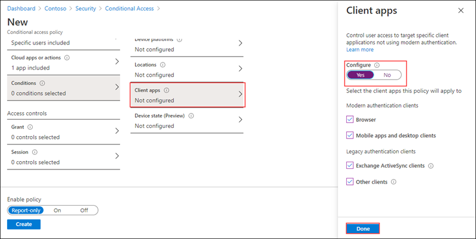

1. Now in Conditions tab select **Client apps** and in **Client apps** page under **Configure** select **Yes** and then select **Done**. You can also make use of other conditions like risk, device platform, or location based on your requirement.

   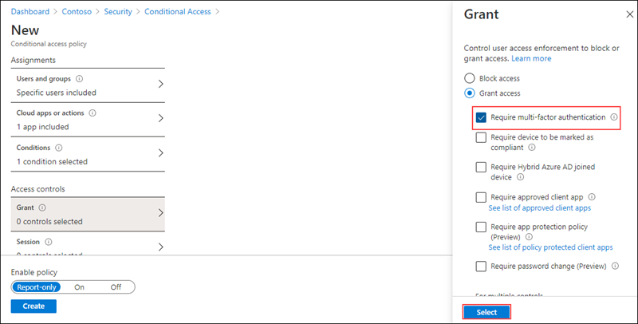

1. Confirm your settings and set Enable policy to **On**. Click on **Create** to create and enable your policy.

   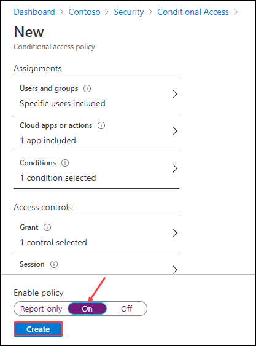

1. Now to test the policy login to the user admin account for whom you enabled MFA. From **App launcher** under Apps, select the app for which you enabled MFA.

1. You're required to register for and use Azure Multi-Factor Authentication. In more information required page click **Next**.

1. Follow the prompts to complete the process and verify you successfully sign in to the portal.

   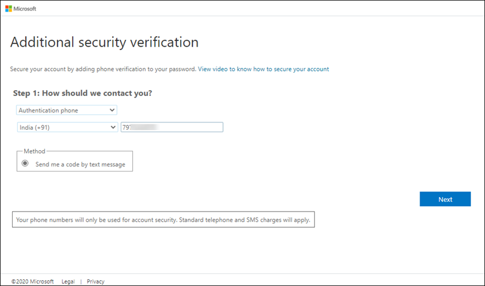
   
   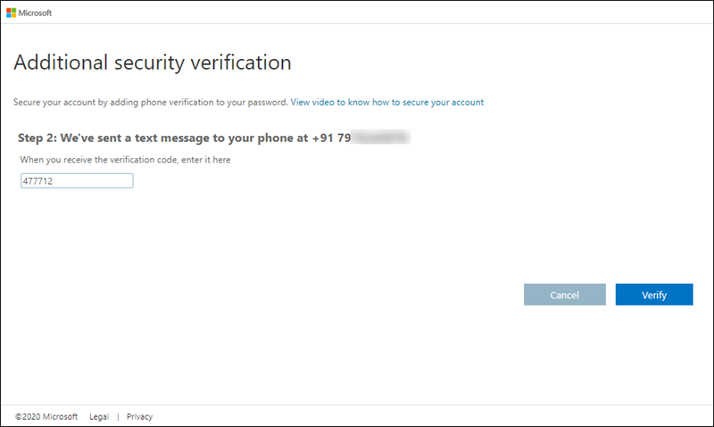

### Task 2 : Azure AD PIM                                                                                                                                                                               
1. Privileged Identity Management (PIM) is a service in Azure Active Directory (Azure AD) that enables you to manage, control, and monitor access to important resources in your organization. These resources include resources in Azure AD, Azure, and other Microsoft Online Services such as Microsoft 365 or Microsoft Intune.

1. From  the navigation menu scroll down to  **Admin centers** and select **Azure Active Directory**, the Azure Active Directory overview page will appear.

   
   
1. In Azure Active Directory page click on **All services**  and select **Azure AD Privileged Identity Management**.

1. Under **Manage** select **Azure AD roles**. 

   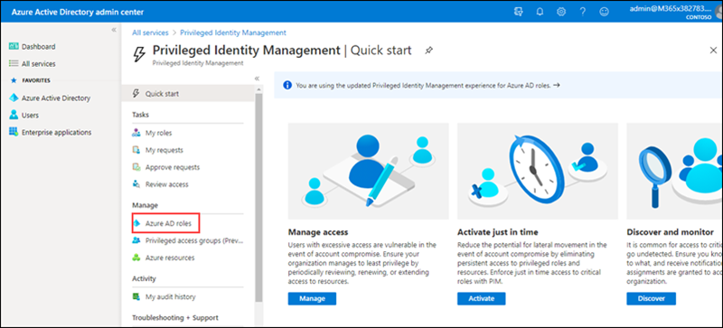

1. Now select **Settings**, from here you can configure role settings. Explore through the roles and select the role which you want to configure.

   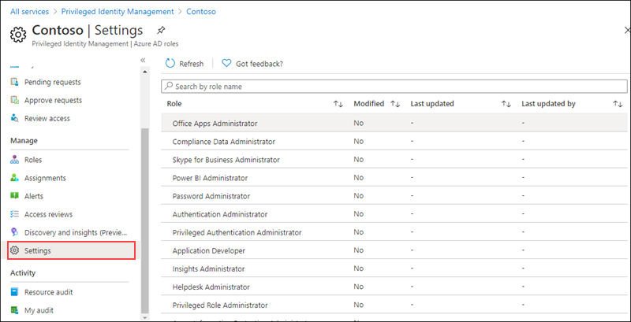

1. Select **Edit** to open the Role settings page. On the Role setting page for each role, there are several settings you can configure.

   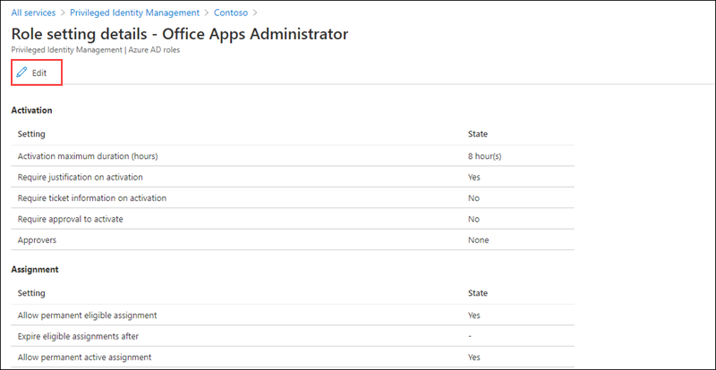

1. Use the **Activation maximum duration** slider to set the maximum time, in hours, that a role stays active before it expires. This value can be from 1 to 24 hours.

   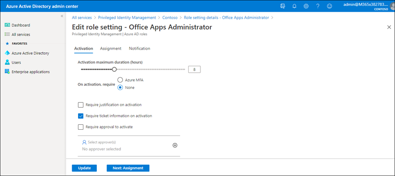

1. To require multi-factor authentication before activation, check the Require Multi-Factor Authentication on activation box in the Assignment tab of Edit role setting.

1. **Requires approval to activate** Specifies whether a member of the Privileged Role Administrators or Security Administrators group is required to approve the activation.

1. Now select **Assignment**, from here you can choose one of these eligible assignment duration options.

   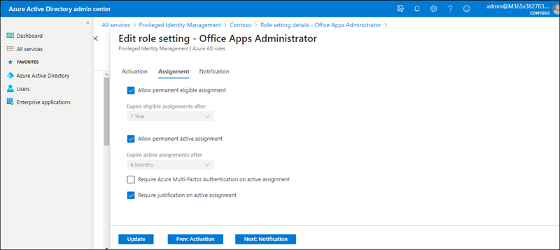

1. Select **Notification**, from here we can configure to receive notification when a member is assigned as eligible to role or when a role is activated.

   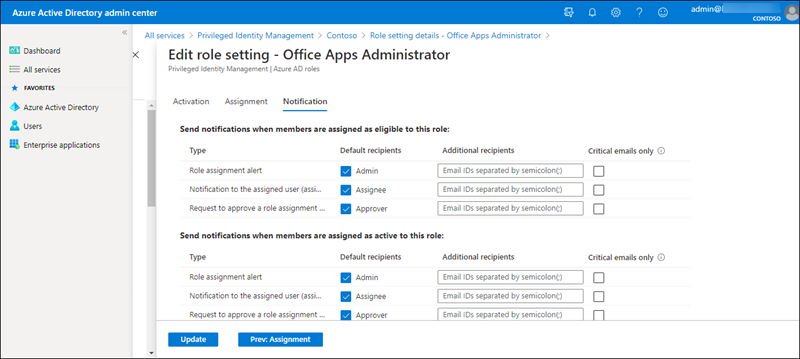

1. Now to assign a role, within **Azure AD Privileged Identity Management** page under manage, click on **Roles**. This displays list of roles for Azure AD permissions.

1. Select **Add assignments** to open the Add assignments page.

   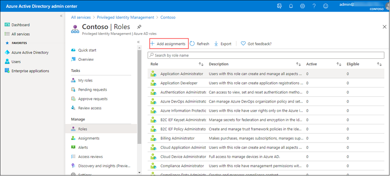

1. From **Select role** drop down select a role you want to assign, and under **Select  members** select a member to whom you want to assign   the role, and then select **Next**.
   
   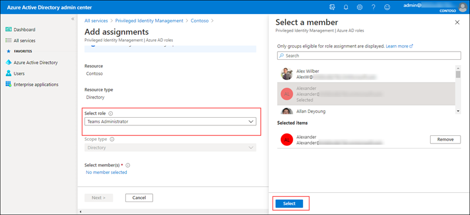

1. In the **Assignment type** list on the **Membership settings** pane, select **Eligible** or **Active**.

     -  **Eligible assignments** require the member of the role to perform an action to use the role. Actions might include performing a multi-factor authentication (MFA) check, providing a business justification, or requesting approval from designated approvers.

     -  **Active assignments** don't require the member to perform any action to use the role. Members assigned as active have the privileges assigned to the role at all times.
     

1. To specify a specific assignment duration, add a start and end date and time boxes. When finished, select **Assign** to create the new role assignment.

   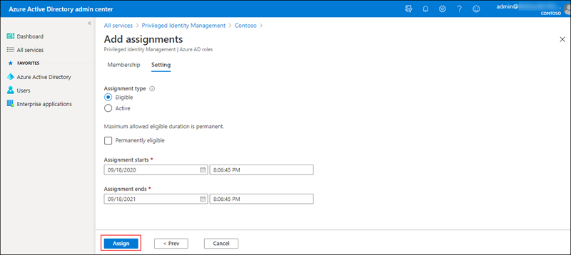

1. After the role is assigned, an assignment status notification is displayed.

1. Now select **Assignments** from here you can check **Eligible**, **Active** and **Expired** assignments. You can also add new assignments from here.

   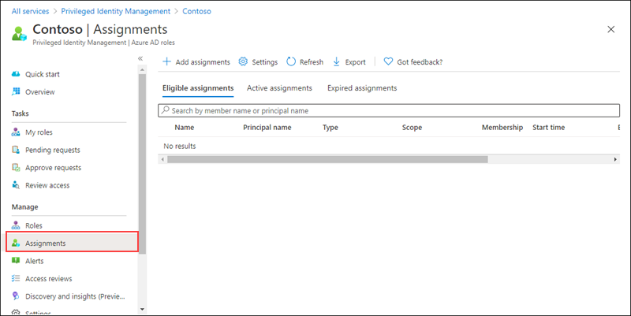

# Exercise 2: Threat Protection 

### Task 1 : Explore MS threat protection portal 

### Task 2 : Microsoft Secure Score 

1. Microsoft Secure Score is a measurement of an organization's security posture, with a higher number indicating more improvement actions taken. Following the Secure Score recommendations can protect your organization from threats. From a centralized dashboard in the Microsoft 365 security center, organizations can monitor and work on the security of their Microsoft 365 identities, data, apps, devices, and infrastructure.

1. From the **App launcher** click on All apps and in the search bar search for **Security**, from **Open context menu** click on Open in new tab. This will redirect you to the **Microsoft 365 security** web page.

1. Select **Secure Score** from the left hand menu. In the **Overview** page your score will be shown as a percentage, along with the number of points you've achieved out of a total possible points.

   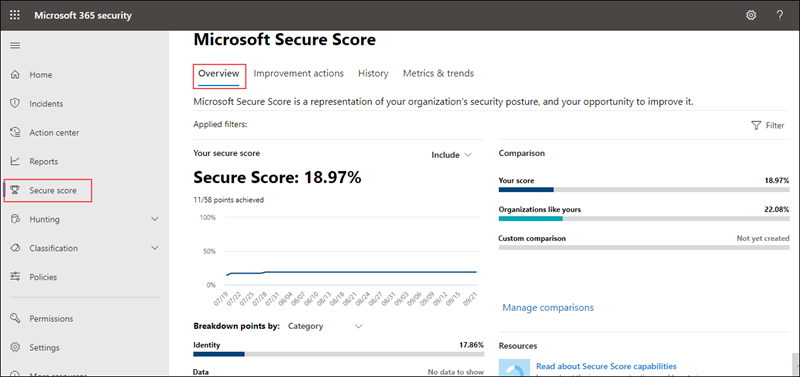

1. Additionally, if you select the Include button next to your score, you can choose different views of your score.

    - **Planned score** : Shows projected score when planned actions are completed.
    
    - **Current license score** : Shows score that can be achieved with your current Microsoft license.
    
    - **Achievable score**: Shows score that can be achieved with your Microsoft licenses and current risk acceptance.
    
       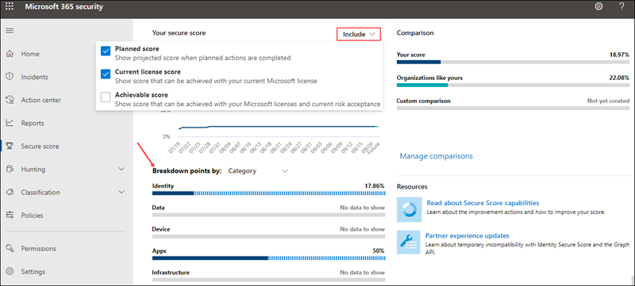
    
1. Now select **Improvement actions** tab, this lists the security recommendations that address possible attack surfaces. It also includes their status (to address, planned, risk accepted, resolved through third party, resolved through alternate mitigation, and completed).

   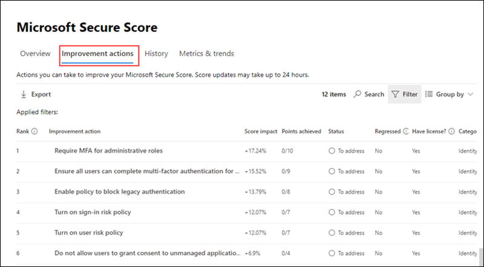

1. When you select a specific improvement action, a full page flyout appears.

   - **Manage** : Select Manage to go to the configuration screen and make the change. You'll then gain the points that the action is worth, visible in the fly out.
   
   - **Share** : Select Share to copy the direct link to the improvement action. You can also choose the platform to share the link, such as email, Microsoft Teams, Microsoft Planner, or ServiceNow. 
   
       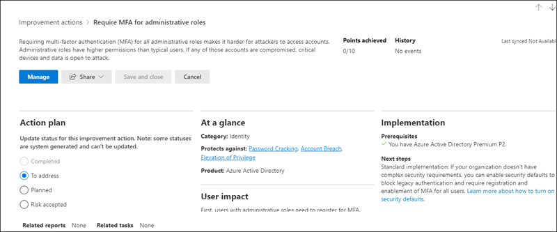

# Exercise 3: Cloud App Security 

### Task 1 : Discover Apps with Cloud App Security  

1. Microsoft Cloud App Security is a multimode Cloud Access Security Broker (CASB). It provides rich visibility, control over data travel, and sophisticated analytics to identify and combat cyberthreats across all your cloud services.

1. In the **admin center**, from the **App launcher** click on **All apps** and in the search bar search for **Security**, from Open context menu click on **Open in new tab**.

1. In the Microsoft 365 security page, click **More resources**, and then select **Cloud App Security**. From the left hand menu select **Dashboard**. In dashboard you can see details about:

   - **Open alerts** : Shows the number of open alerts, a graph of the alert status distribution, and recent alerts

   - **Discovered apps** :Shows the number of discovered apps, a graph of the app risk distribution, and the top app categories by traffic.

   - **Top users to investigate** :Shows the number of users to investigate and the users with the highest investigation priority.

   - **Conditional Access App Control** : Shows the number of apps protected by Conditional Access App Control as well as the number of protected sessions and actions over the last 30 days.
   
   - **App connectors status** : Shows the number of API connected app instances and their status.

   - **Files infected with malware** : Shows the number of files infected with malware.

   - **Privileged Office 365 OAuth apps** : Shows the number of rarely used OAuth apps granted highly privileged permissions.

   - **Azure security configuration** : Shows the number and severity of Azure security configuration recommendations.

1. Now from left navigation menu select **Discover**. Cloud Discovery uses your traffic logs to dynamically discover and analyze the cloud apps that your organization is using.

1. In the Cloud App Security portal, click on Discover then Create snapshot report. 

1. Collect log files from your firewall and proxy, through which users in your organization access the Internet. Make sure to gather logs during times of peak traffic that are representative of all user activity in your organization.

1. If you don't have a log file follow the below steps to download a sample log file.

1. Enter a **Report name** and a **Description**. Select the **Data source** from which you want to upload the log files. Click **View and verify** then Download sample log and unzip it.

1. In **Choose traffic logs** browse and upload the log file which you downloaded. Click **Create**.

1. After upload completes, the status message will appear at the top right corner of your screen letting you know that your log was successfully uploaded.

1. After you upload your log files, it will take some time for them to be parsed and analyzed. Wait till the status of your log files turns ready.

### Exercise 4 : Information Protection 

### Task 1 : Setup Data sensitivity label and policy 

1. Sensitivity labels from the Microsoft Information Protection framework let you classify and protect your organization's data, while making sure that user productivity and their ability to collaborate isn't hindered.

1. In the **admin center**, from  the navigation menu scroll down to  **Admin centers** and select **Compliance**, the Microsoft 365 Compliance center overview page will appear.

   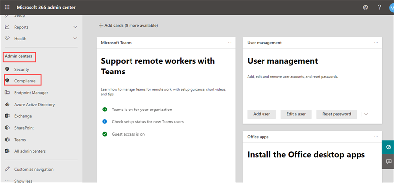

1. Now under **Solutions** select **Information protection**. If you don't immediately see this option, first select **Show all**.

1. On the **Labels** page, select **+ Create a label** to start the New sensitivity label wizard.

   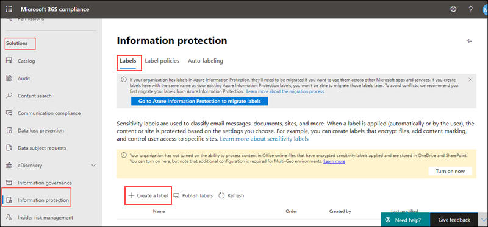

1. Enter a **Label name**  and **Description**. Select **Next**.

   

1. In **Encryption** page, choose when you want to assign permissions, whether you want your users' access to the content to expire, and whether you want to allow offline access. 

      - **Encryption** : select Apply.
      
      - **Assign permissions now or let users decide?** : select Assign permissions now.
      
      - **User access to content expires** : select On a specific date. You can also select other options based on requirement.
      
      - **Acess expires** : Select a date. After this time, users won't be able to open the labeled item.
      
      - **Allow offline access** :  Never, always, or for a specific number of days after the label is applied. If you restrict offline access to never or a number of days, when that threshold is reached, users must be reauthenticated and their access is logged. 
      
         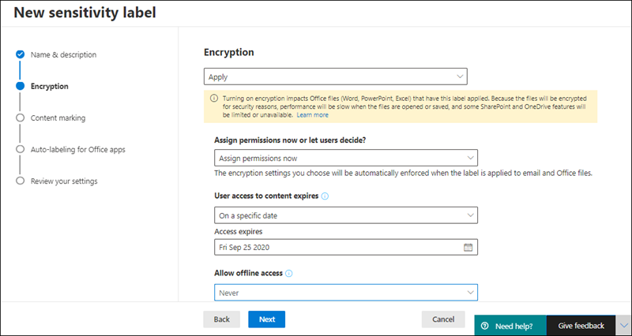
      
1. Under **Assign permissions to specific users or groups** click on **Assign permissions**. From here you can grant permissions to specific people so that only they can interact with the labeled content.
 
1. In **Assign permissions** pane, add users or groups that will be assigned permissions to the labeled content. For now select **+ Add users or groups** and select the user or group for whom you want to assign the label. Select **Add**.

   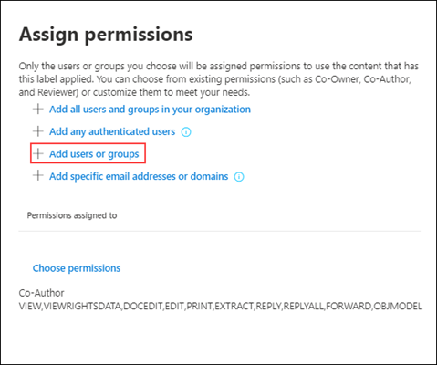
 
1. Now in **Assign permissions** pane, click on **Choose permissions**. 

   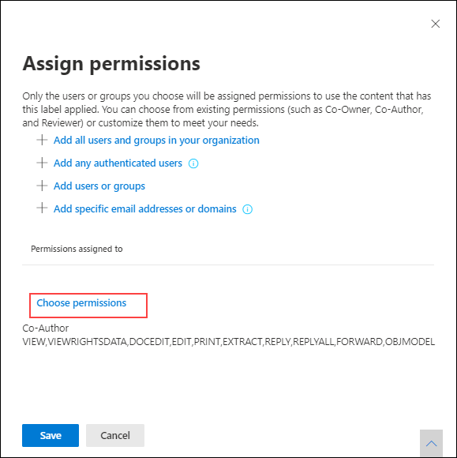

1. When you choose which permissions to allow for those users or groups, you can select either a predefined permissions level with a preset group of rights, such as Co-Author, CO-Owner, Reviewer or Viewer and Custom permissions, where you choose one or more usage rights.

   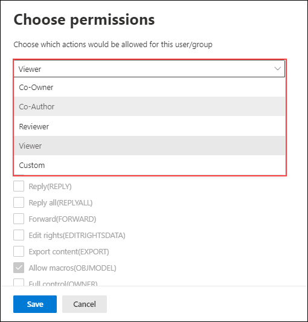
   
1. On the **Assign Permissions** pane, select **Save**. Click on **Next**.

   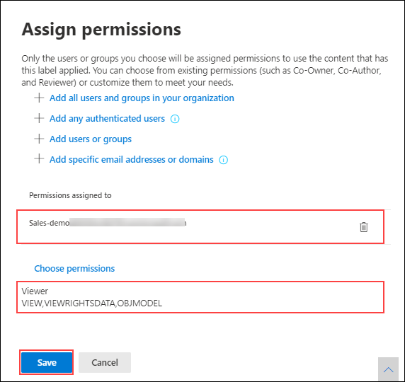

1. On the **Content Marking** page, you can configure the Header, Footer and the Water Marking for this label. Click Next.

   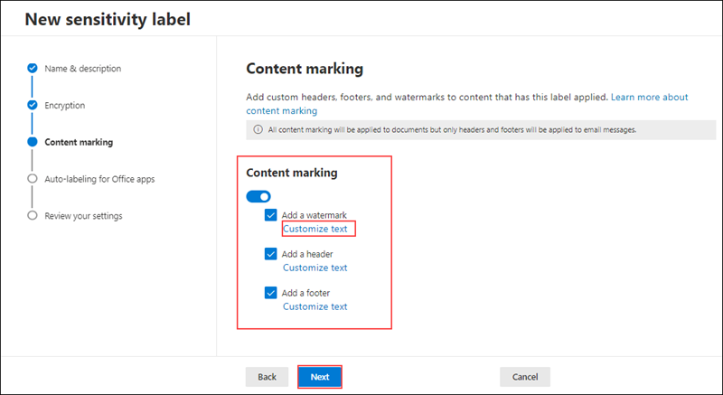
   
   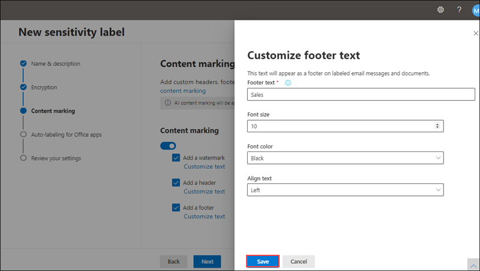

1. In **Auto-labeling for Office apps**, turn on **Auto labeling**. Add a condition, under **Detect content that matches these conditions**, select Add a condition. 

   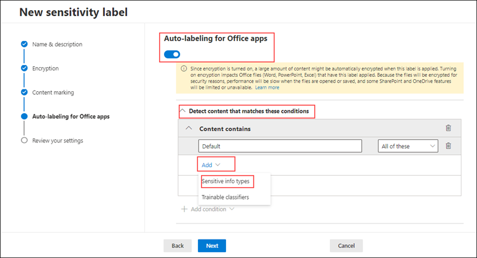
   
   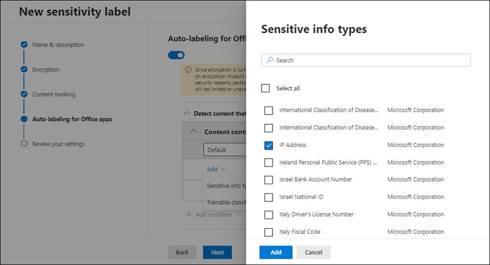

1. Select **Next**. Review your settings, and select **Create**. Your label will be created. Repeat this process for any additional labels you want.

   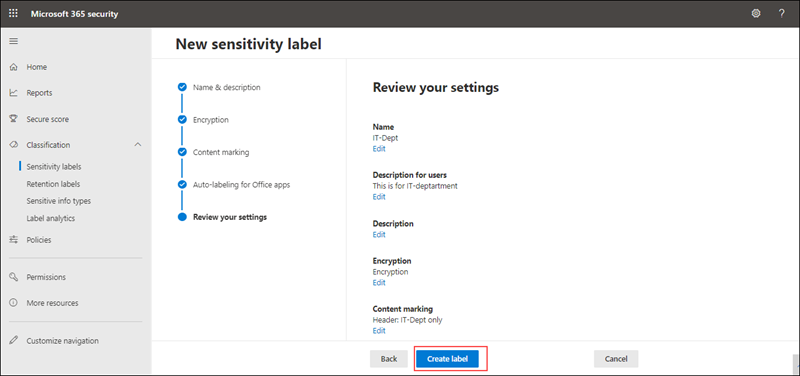

1. Click on your newly created label from here you can edit, publish or delete it.

   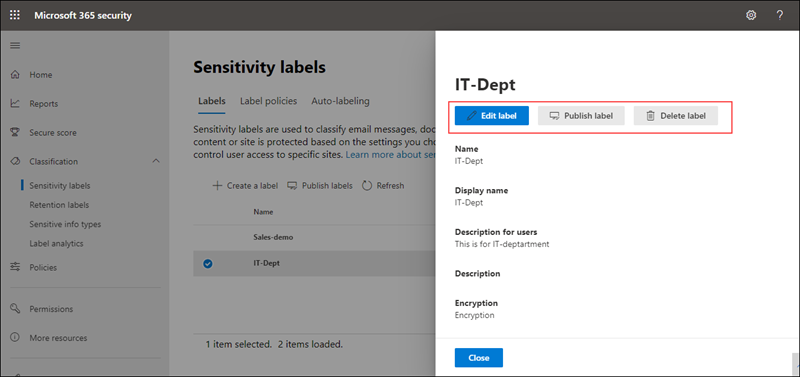

1. Now click on **Label policies** and select **Publish labels**. 

   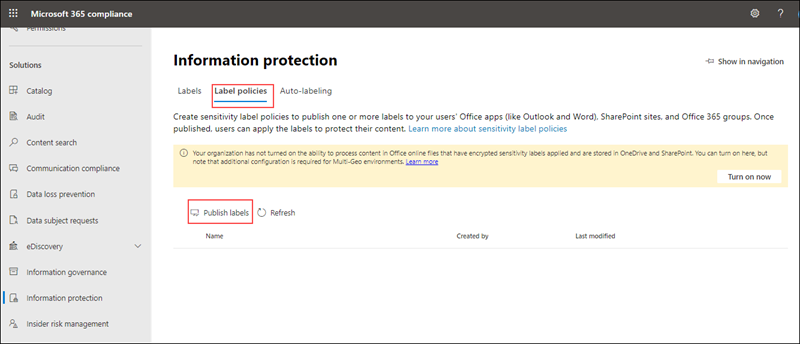

1. On the next page Click  **Choose sensitivity labels to publish**, and select your newly created label and click **ADD**  and then click **Next**.

   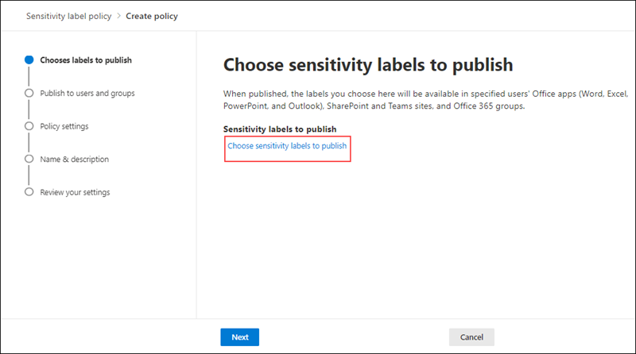
   
   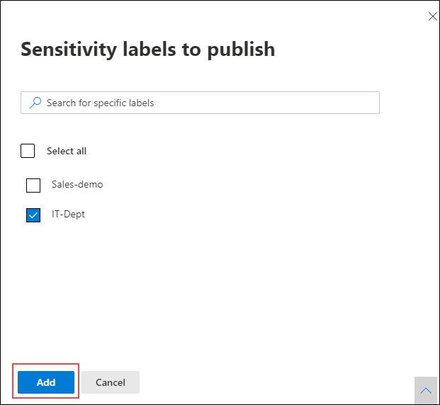

1. In **Publish to users and groups** pane select the **Users and Groups** and click on **Add**. Now select users or groups which you are going to publish this label and Click **Next** to continue.
   
   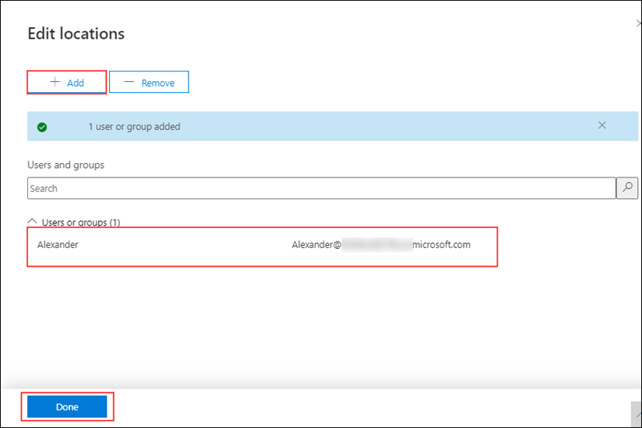

1. Under the **Policy Setting**, select the way you prefer and click **Next**.

   

1. Provide Name and Description for your policy. Click **Next**.

   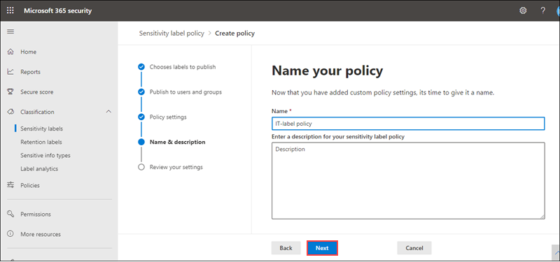

1. Click **Submit** to finish the policy creation for the label.

   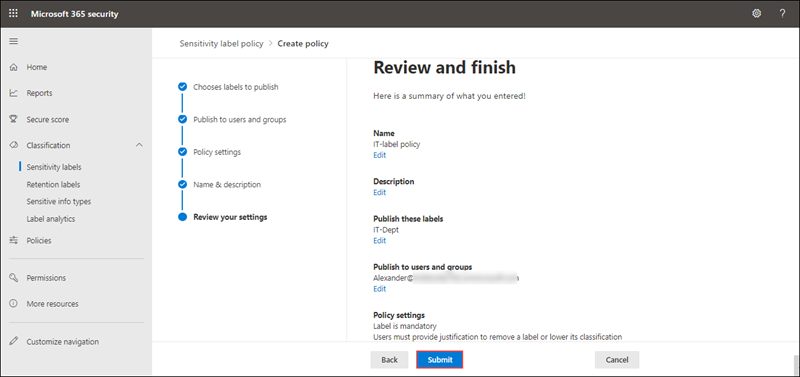
   
1. In order for your labels to work, each user needs to download the Azure Information Protection unified labeling client. Search the web for **AzinfoProtection_UL.exe**, then download it from the Microsoft Download Center, and run it on your users' computers.

1. The next time you open an Office app like Word, you'll see the sensitivity labels that were created. 

### Exercise 5 : Compliance Manager 

### Task 1 : Explore Compliance Manager 

1. Compliance Manager measures your progress in completing actions that help reduce risks around data protection and regulatory standards.

1. In the **admin center**, from  the navigation menu scroll down to  **Admin centers** and select **Compliance**, the Microsoft 365 Compliance center overview page will appear.

   

1. From the left navigation pane select **Compliance Manager**. In the overview page you can see your overall Compliance score, Compliance score breakdown.

   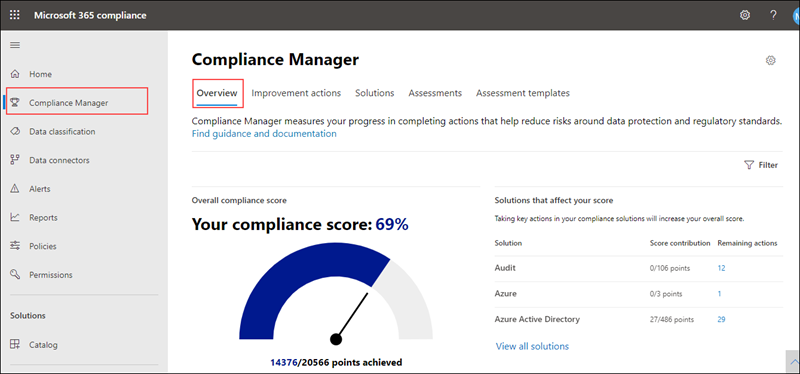

1. In the **Compliance Manager** page, select **Improvement action**. This displays the list of actions you can take to improve your compliance score. Each improvement action provides recommended guidance that’s intended to help you align with data protection regulations and standards.

   

1. In the **Compliance Manager** page, select **Solutions** tab. The solutions page displays your organization’s solutions that are connected to improvement actions. The table lists each solution’s contribution to your overall score, the points achieved and possible within that solution, and the remaining number of improvement actions grouped in that solution that can increase your score.

   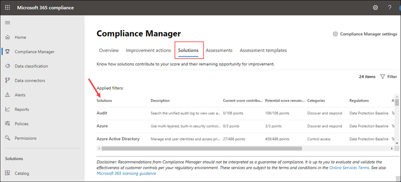

1. On the row of your intended solution, under the Remaining actions column, select the hyperlinked number. You’ll see a filtered view of the improvement actions screen showing untested improvement actions for that solution.

   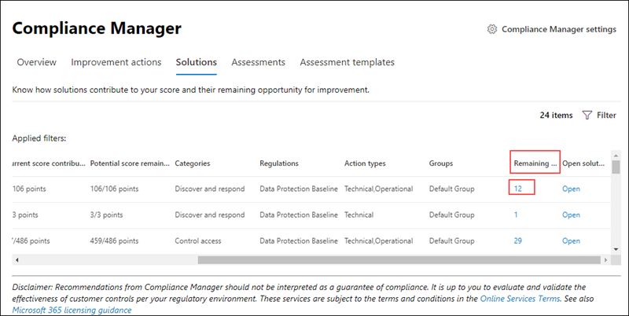

1. On the row of your intended solution, under the Open solution column, select Open. You’ll see the solution or location in the Microsoft 365 and Office 365 security and compliance centers where you can take the recommended action.

   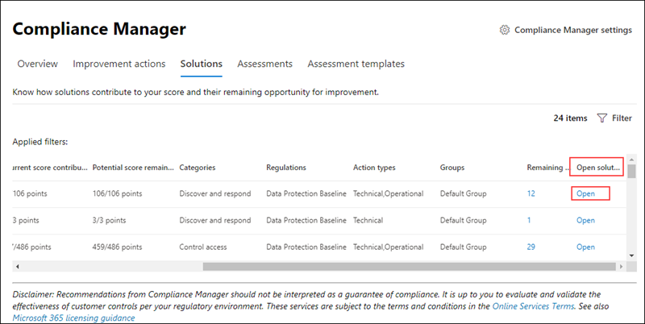
   
1. Now in the **Compliance Manager** page select **Assessments**. Assessments help us to implement data protection controls specified by compliance, security, privacy, and data protection standards, regulations, and laws. 

1. The assessments page summarizes key information about each assessment:

      - **Status** : Complete, Incomplete, None or In progress.
      
      - **Assessment progress**: the percentage of the work done toward completion, as measured by the number of controls successfully tested.
      
      - **Your improvement actions**: the number of completed actions to satisfy implementation of your controls.
      
      - **Microsoft actions**: the number of completed actions to satisfy implementation of Microsoft controls.
      
      - **Group**: name of the group the assessment belongs to.
      
      - **Product**: associated Microsoft 365 service.
      
      - **Regulation**: the regulatory standard, policy, or law that applies to the assessment.
      
         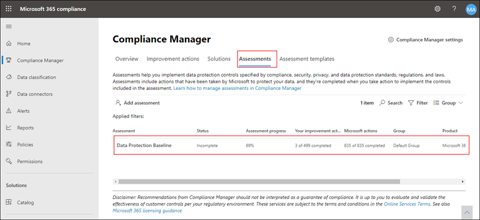

1. In the **Assessments** dashboard, select the assessment name to open it and view the Action Items and Controls Info.

### Task 2 : Customer Lockbox 

1. Customer Lockbox ensures that Microsoft cannot access your content to perform a service operation without your explicit approval. Customer Lockbox brings you into the approval workflow for requests to access your content.

1. In the **admin center**, from  the navigation menu scroll down to  **Settings** and select **Org settings**.

1. Select **Services** in the search bar search and select  **Customer Lockbox**.

   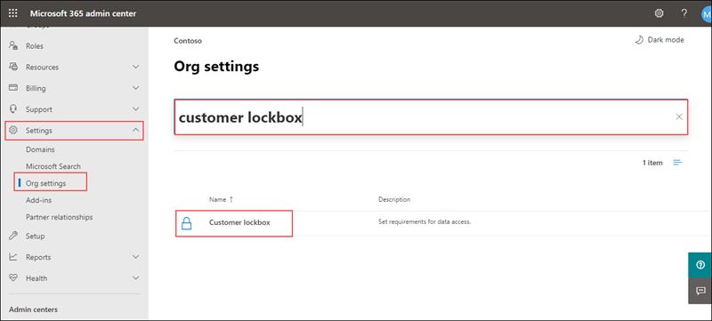

1. Now enable the setting **Require approval for all data access requests**.

   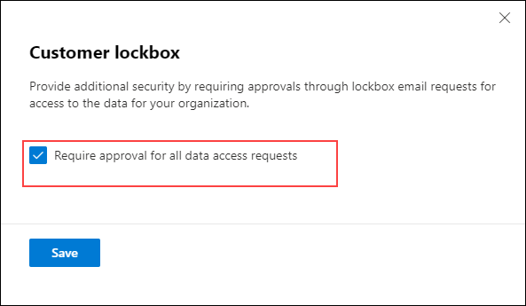

1. To approve or deny requests, head over to the Office 365 admin center and under **Support** select **Customer Lockbox requests**. User with Global Admin role and Customer Lockbox access approver role can approve or deny requests.

   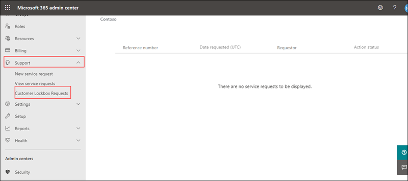
   

      
