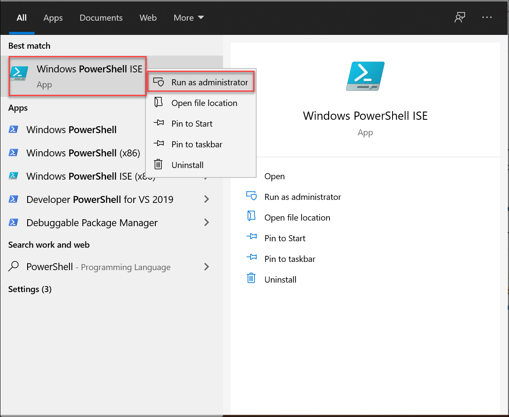

# Know before testing
## Activating the protection service from Azure Information Protection

1. In the **Search** field on the taskbar at the bottom of the desktop, enter **PowerShell**.

   

    **Important:** you should select **Windows PowerShell ISE** (not Windows PowerShell); therefore, right-click on **Windows PowerShell ISE** and select **Run as administrator**.

    

1. If a **User Account Control** dialog box appears, select **Yes** to allow this app to make changes to your device.

1. Run the following command to install Azure Information Protection

   **Note**: If you are prompted to confirm an Execution Policy Change, select Yes to All
   
       Install-Module -Name AIPService

1. Run the following command. In the **Sign in** dialog box, Enter the **username** and **password** as provided in the environment detail tab for your Azure Information Protection tenant.

       Connect-AipService

1. Run the command to confirm whether the protection service is activated. A status of Enabled confirms activation; Disabled indicates that the service is deactivated.
  
       Get-AipService
    
1. To activate the service, run the command.

       Enable-AipService
       
1. On the Next Page, Learn about how to create users, assign a license to the users, verify custom domains in the tenant, and see how to access other admin centers.
       
       
